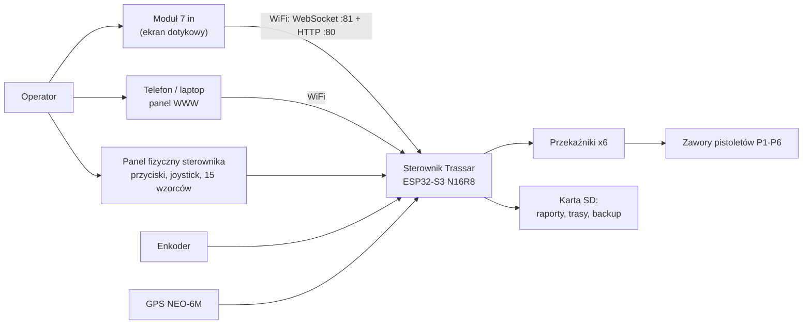

# MPD2026 — komputer pokładowy malowarki pasów drogowych

Firmware sterownika **Trassar** (ESP32-S3 N16R8) wraz z **modułem wyświetlacza 7"** (Sunton ESP32-8048S070C)
i aplikacją Android. Projekt jest rozwojową wersją bazową `Trassar_251v3`
([miastekpl/Trassar_251v3](https://github.com/miastekpl/Trassar_251v3)), która pozostaje niezmienioną referencją.
Wszystkie nowe prace prowadzone są w tym repozytorium.

| Element | Wersja | Katalog |
|---------|--------|---------|
| Firmware sterownika | 2.52.0 | `src/`, `platformio.ini` |
| Moduł wyświetlacza 7" | 0.1.0 | `display-module/` |
| Aplikacja Android | — | `android-app/` |

## Co robi system

- Steruje **6 pistoletami natryskowymi** (P1–P6) wg **16 wzorców** polskiego oznakowania poziomego
  (15 normowych P-1a … P-7d + wzorzec własny w 3 slotach).
- **Tryby pracy:** AUTO, SEMI (przerwa kontrolowana przez operatora), RĘCZNY (strzał tylko przy trzymanym
  fizycznym START), DEMO (bez strzelania).
- Mierzy dystans i prędkość (enkoder), pozycję (GPS) i zużycie farby; zapisuje raporty, trasy GPX/GeoJSON
  i kopię ustawień na karcie SD.
- **Duży ekran 7"** w stylu kabinowym: prędkość 7-segmentowa, animowany widok drogi, wzorce po bokach,
  START/STOP/tryby na dole — [opis](docs/MODUL_WYSWIETLACZA.md).
- **Mniej przycisków fizycznych bez utraty wzorców:** układ **soft-key** — 10 przycisków przy ekranie + GRUPA
  zamiast 15; wzorce podzielone na **OŚ** (10) i **KRAWĘDŹ** (5 + własny), etykiety na ekranie 7".
- Wielowarstwowe zabezpieczenia: przerwanie awaryjnego STOP, gun keepalive 300 ms, limity prędkości, watchdog 5 s,
  shutdown handler, detekcja anomalii pistoletów.

## Architektura



Sterownik działa **samodzielnie**; moduł 7" jest panelem operatora i nie steruje pistoletami bezpośrednio.
**Fizyczny STOP na sterowniku jest głównym zabezpieczeniem.**

## Szybki start

```bash
# sterownik
pio run -e esp32s3                 # kompilacja
pio run -e esp32s3 -t upload       # wgranie
pio device monitor                 # monitor 115200

# moduł wyświetlacza 7"
cd display-module
pio run -t upload
```

1. Włącz sterownik — ekran startowy pokaże SSID `TrassarV3`, **hasło (8 znaków, wyliczane z MAC)** i adres
   `http://192.168.4.1`.
2. Na module 7": **MENU → POŁĄCZENIE WiFi**, wpisz hasło i zapisz.
3. Skalibruj enkoder (odcinek 10 m), wybierz wzorzec i naciśnij START.

Szczegóły: [Instrukcja obsługi](docs/INSTRUKCJA_OBSLUGI.md).

## Dokumentacja

| Dokument | Zawartość |
|----------|-----------|
| [Instrukcja obsługi](docs/INSTRUKCJA_OBSLUGI.md) | obsługa modułu 7" i panelu fizycznego, tryby, kalibracja, alarmy, 11 przykładów |
| [Schemat połączeń](docs/SCHEMAT_PODLACZEN.md) | architektura, BOM, mapa GPIO, schematy wszystkich modułów, złącza J1–J5, zasilanie, diagnostyka |
| [Instrukcja terenowa](docs/INSTRUKCJA_TERENOWA.md) | praca w terenie: przygotowanie, procedury malowania, farba, awarie, konserwacja, karty do wydruku |
| [Łącze przewodowe](docs/LACZE_PRZEWODOWE.md) | analiza: kabel RS-485 zamiast WiFi, piny, protokół, plan wdrożenia (propozycja) |
| [Wizualizacje panelu](docs/WIZUALIZACJE.md) | makieta ekranu i 4 propozycje wyglądu kontrolera (SVG), porównanie i rekomendacja |
| [Moduł wyświetlacza 7"](docs/MODUL_WYSWIETLACZA.md) | architektura firmware modułu, komunikacja, UI, rozszerzanie |
| [API sterownika](docs/API_WWW.md) | REST + WebSocket, wszystkie pola i polecenia |
| [Historia zmian](CHANGELOG.md) | changelog |
| [Roadmap](docs/ROADMAP.md), [Przegląd kodu](docs/CODE_REVIEW.md) | plany i uwagi jakościowe (dokumenty z wersji bazowej) |
| [CLAUDE.md](CLAUDE.md) | konwencje kodu i architektura dla pracy z Claude Code |

## Struktura repozytorium

```
MPD2026/
├── platformio.ini              # sterownik (env esp32s3) + testy logiki (env native)
├── src/                        # firmware sterownika
├── data/                       # zasoby LittleFS (panel WWW)
├── test/                       # testy jednostkowe (native)
├── display-module/             # firmware modułu 7" (LVGL)
│   └── src/
├── android-app/                # aplikacja Android (Kotlin)
├── docs/                       # dokumentacja
├── CHANGELOG.md
└── CLAUDE.md
```

## Sprzęt

- **Sterownik:** ESP32-S3 N16R8 DevKitC-1, TFT ILI9341 2,8" + SD, DS1307, MCP23017 (przyciski wzorców: 15 klasycznych albo 10 + GRUPA),
  3 przyciski + GAP, joystick KY-023, enkoder, GPS GY-NEO6MV2, moduł 6 przekaźników, buzzer, opcjonalnie DS18B20.
- **Moduł 7":** Sunton ESP32-8048S070C (7" IPS 800×480, dotyk GT911, 8 MB PSRAM).
- **Złącza maszynowe:** J1 zasilanie, J2 zawory, J3 enkoder, J4 pilot, J5 przycisk nożny.

Pełny schemat i tabele pinów: [SCHEMAT_PODLACZEN.md](docs/SCHEMAT_PODLACZEN.md).

## Bezpieczeństwo

Zawory pistoletów pracują na napięciu instalacji maszyny (12/24 V) i są odizolowane od ESP32. Przed pracą przy
pistoletach zatrzymaj maszynę i odłącz zasilanie. Nie wciskaj joysticka sterownika przy włączaniu zasilania
(GPIO 46 to pin rozruchowy). Nie podłączaj niczego do GPIO 26–37 (PSRAM/Flash).

## Licencja

Projekt prywatny. Wszelkie prawa zastrzeżone.
