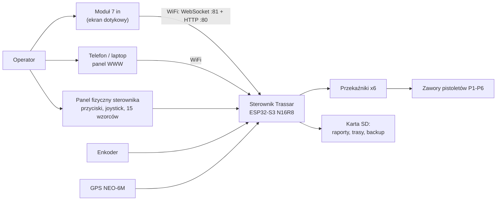

# MPD2026 — komputer pokładowy malowarki pasów drogowych

Firmware sterownika **Trassar** (ESP32-S3 N16R8) wraz z **modułem wyświetlacza 7"** (Sunton ESP32-8048S070C)
i aplikacją Android. Projekt jest rozwojową wersją bazową `Trassar_251v3`
([miastekpl/Trassar_251v3](https://github.com/miastekpl/Trassar_251v3)), która pozostaje niezmienioną referencją.
Wszystkie nowe prace prowadzone są w tym repozytorium.

| Element | Wersja | Katalog |
|---------|--------|---------|
| Firmware sterownika | 2.53.0 | `src/`, `platformio.ini` |
| Moduł wyświetlacza 7" (wariant WiFi) | 0.1.1 | `display-module/` |
| Aplikacja Android | — | `android-app/` |

## Co robi system

- Steruje **6 pistoletami natryskowymi** (P1–P6) wg **16 wzorców** polskiego oznakowania poziomego
  (15 normowych P-1a … P-7d + wzorzec własny w 3 slotach).
- **Tryby pracy:** AUTO, SEMI (przerwa kontrolowana przez operatora), RĘCZNY (strzał tylko przy trzymanym
  fizycznym START), DEMO (bez strzelania).
- Mierzy dystans i prędkość (enkoder), pozycję (GPS) i zużycie farby; zapisuje raporty, trasy GPX/GeoJSON
  i kopię ustawień na karcie SD.
- **Duży ekran 7"** w stylu kabinowym: prędkość 7-segmentowa, animowany widok drogi, wzorce po bokach,
  START/STOP/tryby na dole — [opis](docs/MODUL_WYSWIETLACZA.md).
- **Mniej przycisków fizycznych bez utraty wzorców:** układ **soft-key** — 10 przycisków przy ekranie + GRUPA
  zamiast 15; wzorce podzielone na **OŚ** (10) i **KRAWĘDŹ** (5 + własny), etykiety na ekranie 7".
- Wielowarstwowe zabezpieczenia: przerwanie awaryjnego STOP, gun keepalive 300 ms, limity prędkości, watchdog 5 s,
  shutdown handler, detekcja anomalii pistoletów.

## Architektura


```mermaid
flowchart LR
    OP["Operator"] --> MOD["Moduł 7 in<br/>(ekran dotykowy)"]
    OP --> PAN["Panel fizyczny sterownika<br/>przyciski, joystick, 15 wzorców"]
    OP --> WWW["Telefon / laptop<br/>panel WWW"]
    MOD -- "WiFi: WebSocket :81 + HTTP :80" --> STER
    WWW -- "WiFi" --> STER
    PAN --> STER["Sterownik Trassar<br/>ESP32-S3 N16R8"]
    STER --> REL["Przekaźniki x6"] --> ZAW["Zawory pistoletów P1-P6"]
    ENC["Enkoder"] --> STER
    GPS["GPS NEO-6M"] --> STER
    STER --> SD["Karta SD:<br/>raporty, trasy, backup"]
```

Sterownik działa **samodzielnie**; moduł 7" jest panelem operatora i nie steruje pistoletami bezpośrednio.
**Fizyczny STOP na sterowniku jest głównym zabezpieczeniem.**

## Docelowa architektura (decyzja: sterownik "headless" + moduł Sunton po WiFi)

Sterownik **nie ma żadnego ekranu podłączonego bezpośrednio** — cała logika, stan i dane są w nim (master), a
interfejs operatora to **moduł wyświetlacza 7" Sunton ESP32-8048S070C** (`display-module/`, LVGL), połączony
przez WiFi (WebSocket :81 + HTTP :80). **Cały interfejs to kod C++, który można dowolnie zmieniać bez żadnego
zewnętrznego narzędzia GUI.** Mały ekran ILI9341 i joystick są wyłączone (Sunton ma pełne menu i dotyk); status
STOP-u awaryjnego (E-STOP, sprzętowe cięcie zasilania) jest włączony. Sterownik ma 23 zajęte i 6 wolnych pinów.

```bash
# wariant DOCELOWY: sterownik headless + moduł Sunton po WiFi
pio run -e esp32s3 -t upload
cd display-module && pio run -t upload
```

> **Alternatywa (nie zalecana jako punkt startowy):** wyświetlacz inteligentny DWIN DGUS podłączony bezpośrednio
> przewodem UART, bez pośredniczącego ESP32 — prostsze okablowanie (4 przewody), ale wymaga **ręcznego** zbudowania
> projektu ekranu w DGUS Designer (osobne narzędzie GUI producenta, tylko Windows). Środowisko `esp32s3_terminal`,
> opis: [docs/ARCHITEKTURA_TERMINAL.md](docs/ARCHITEKTURA_TERMINAL.md),
> [docs/EKRAN_DGUS.md](docs/EKRAN_DGUS.md). **Status: kod sterownika gotowy i skompilowany, ale projekt ekranu
> w DGUS Designer nie został zbudowany i nic nie było sprawdzone na sprzęcie.**

## Moduł 7" (Sunton) — rola ekranu roboczego

Jedyny ekran systemu: wzorce z rysunkami w skali, START/STOP, tryby, prędkość, droga, farba, statystyki,
kalibracja, menu serwisowe (czyszczenie dysz, reset, eksport, factory reset), SETUP — patrz
[docs/MODUL_WYSWIETLACZA.md](docs/MODUL_WYSWIETLACZA.md).

## Szybki start

```bash
# sterownik
pio run -e esp32s3                 # kompilacja
pio run -e esp32s3 -t upload       # wgranie
pio device monitor                 # monitor 115200

# moduł wyświetlacza 7"
cd display-module
pio run -t upload
```

1. **Pierwsze uruchomienie (parowanie):** podłącz sterownik do laptopa przez USB, otwórz monitor portu
   szeregowego (115200 baud) — w logu `[POST]` zobaczysz SSID `TrassarV3`, **hasło (8 znaków, wyliczane z MAC —
   stałe dla danego egzemplarza sterownika)** i adres `http://192.168.4.1`. Sterownik nie ma już własnego ekranu,
   więc to jedyne miejsce, gdzie hasło się pokazuje — warto je od razu nakleić na obudowę.
2. Na module 7": **MENU → POŁĄCZENIE WiFi**, wpisz hasło i zapisz (moduł zapamiętuje je na stałe — kolejne
   uruchomienia łączą się automatycznie, bez powtarzania tego kroku).
3. Skalibruj enkoder (odcinek 10 m), wybierz wzorzec i naciśnij START.

Szczegóły: [Instrukcja obsługi](docs/INSTRUKCJA_OBSLUGI.md).

## Dokumentacja

| Dokument | Zawartość |
|----------|-----------|
| [Instrukcja obsługi](docs/INSTRUKCJA_OBSLUGI.md) | obsługa modułu 7"/WWW i przycisków fizycznych, tryby, kalibracja, STOP awaryjny, pomiar dystansu z alarmem, alarmy, 13 przykładów |
| [Instrukcja montażu](docs/INSTRUKCJA_MONTAZU.md) | montaż krok po kroku: obudowa, okablowanie, E-STOP, pierwsze uruchomienie, checklist, częste błędy |
| [Schemat połączeń](docs/SCHEMAT_PODLACZEN.md) | architektura, BOM, mapa GPIO, schematy wszystkich modułów, złącza J1–J5, zasilanie, diagnostyka |
| [Architektura DGUS (alternatywa)](docs/ARCHITEKTURA_TERMINAL.md) | sterownik jako mózg + wyświetlacz DGUS na UART: protokół, piny, bezpieczeństwo, mapa kodu, próby sprzętowe — wymaga DGUS Designer |
| [Ekran DGUS — specyfikacja](docs/EKRAN_DGUS.md) | strony, pola VP, przyciski i kody zdarzeń — do zbudowania w DGUS Designer (tylko dla alternatywy DGUS) |
| [Instrukcja terenowa](docs/INSTRUKCJA_TERENOWA.md) | praca w terenie: przygotowanie, procedury malowania, farba, awarie, konserwacja, karty do wydruku |
| [Łącze przewodowe](docs/LACZE_PRZEWODOWE.md) | analiza RS-485 jako opcja dla długich przewodów (materiał pomocniczy; domyślne połączenie z ekranem DGUS jest bezpośrednie) |
| [Wizualizacje panelu](docs/WIZUALIZACJE.md) | makieta ekranu i 4 propozycje wyglądu kontrolera (SVG), porównanie i rekomendacja |
| [Moduł wyświetlacza 7"](docs/MODUL_WYSWIETLACZA.md) | architektura firmware modułu, komunikacja, UI, rozszerzanie |
| [API sterownika](docs/API_WWW.md) | REST + WebSocket, wszystkie pola i polecenia |
| [Historia zmian](CHANGELOG.md) | changelog |
| [Roadmap](docs/ROADMAP.md), [Przegląd kodu](docs/CODE_REVIEW.md) | plany i uwagi jakościowe (dokumenty z wersji bazowej) |
| [CLAUDE.md](CLAUDE.md) | konwencje kodu i architektura dla pracy z Claude Code |

## Struktura repozytorium

```
MPD2026/
├── platformio.ini              # sterownik: env esp32s3 (docelowy, headless+Sunton), esp32s3_terminal (alt. DGUS), native (testy)
├── src/                        # firmware sterownika
├── shared/                     # dgus_protocol.h — ramka protokołu DGUS (sterownik + testy)
├── data/                       # zasoby LittleFS (panel WWW)
├── test/                       # testy jednostkowe (native): logika wzorców, protokół ekranu DGUS
├── display-module/             # firmware modułu 7" (LVGL, WiFi): env sunton7, sunton7_portrait
│   └── src/
├── android-app/                # aplikacja Android (Kotlin)
├── docs/                       # dokumentacja
├── CHANGELOG.md
└── CLAUDE.md
```

## Sprzęt

- **Sterownik:** ESP32-S3 N16R8 DevKitC-1, headless (bez ekranu bezpośrednio podłączonego) + SD (osobny moduł SPI),
  DS1307, MCP23017 (przyciski wzorców: 15 klasycznych albo 10 + GRUPA), 3 przyciski + GAP, status STOP-u
  awaryjnego (E-STOP), enkoder, GPS GY-NEO6MV2, moduł 6 przekaźników, buzzer, opcjonalnie DS18B20.
- **Moduł 7" (docelowy, WiFi):** Sunton ESP32-8048S070C (7" IPS 800×480, dotyk GT911, 8 MB PSRAM) — jedyny ekran systemu.
- **Ekran DGUS (alternatywa, wymaga DGUS Designer):** np. DWIN `DMG10600T070_09WTC` (7" IPS 1024×600, dotyk pojemnościowy, 650 cd/m²) — własna elektronika, bez ESP32, podłączony bezpośrednio przewodem UART zamiast modułu Sunton.
- **Złącza maszynowe:** J1 zasilanie, J2 zawory, J3 enkoder, J4 pilot, J5 przycisk nożny.

Pełny schemat i tabele pinów: [SCHEMAT_PODLACZEN.md](docs/SCHEMAT_PODLACZEN.md).

## Bezpieczeństwo

Zawory pistoletów pracują na napięciu instalacji maszyny (12/24 V) i są odizolowane od ESP32. Przed pracą przy
pistoletach zatrzymaj maszynę i odłącz zasilanie. Nie wciskaj joysticka sterownika przy włączaniu zasilania
(GPIO 46 to pin rozruchowy). Nie podłączaj niczego do GPIO 26–37 (PSRAM/Flash).

## Licencja

Projekt prywatny. Wszelkie prawa zastrzeżone.
