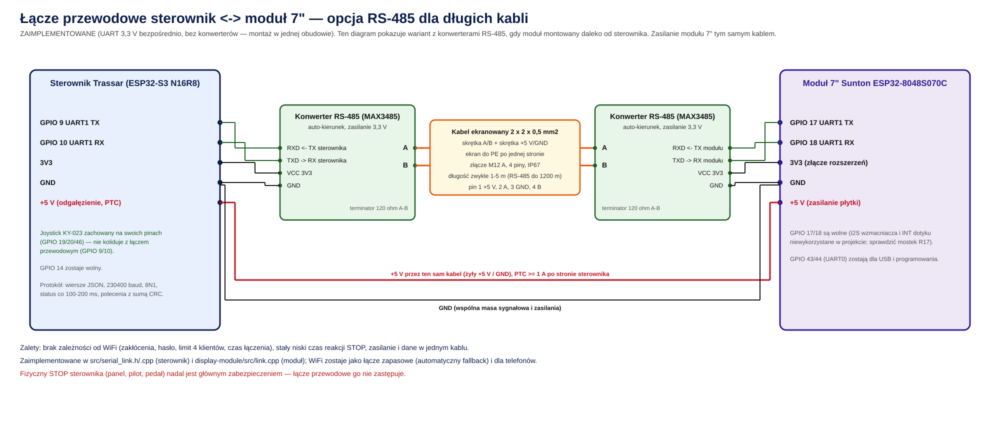

# Łącze przewodowe sterownik ↔ moduł 7" (zamiast WiFi)

> **Status: ZAIMPLEMENTOWANE.** Architektura docelowa to sterownik ESP32-S3 + moduł wyświetlacza **Sunton
> ESP32-8048S070C (LVGL, dotyk GT911)**, połączone **dwoma równoległymi transportami jednocześnie**: łączem
> przewodowym UART (priorytet, ten dokument) i WiFi (automatyczne łącze zapasowe oraz jedyne dla telefonu/tabletu
> w panelu WWW). Wariant z ekranem DWIN DGUS (`ARCHITEKTURA_TERMINAL.md`) pozostaje jako alternatywa nierekomendowana
> (wymaga ręcznej pracy w DGUS Designerze) — patrz środowisko `esp32s3_terminal` w `platformio.ini`.
>
> **Joystick fizyczny jest zachowany** — w przeciwieństwie do wcześniejszej wersji tego dokumentu, łącze przewodowe
> NIE wymaga rezygnacji z joysticka. Piny sterownika to **GPIO 9 (TX) / GPIO 10 (RX)**, wolne dzięki temu że wariant
> DGUS (który też ich używał) jest osobnym, wykluczającym się środowiskiem kompilacji. Zobacz zaktualizowaną tabelę
> pinów w [sekcji 3](#3-piny-zaimplementowane).
>
> Implementacja: `shared/serial_link_protocol.h` (framing/CRC, wspólny nagłówek), `src/serial_link.h/.cpp` (strona
> sterownika, UART1 przez ESP-IDF `driver/uart.h`), `display-module/src/link.cpp` (strona modułu Sunton, `HardwareSerial`
> UART1) — patrz [sekcja 5](#5-protokół-zaimplementowany).

**Krótka odpowiedź: tak — w maszynie pracującej w terenie łącze przewodowe jest lepsze niż WiFi.** Zaimplementowano
bezpośrednie UART 3,3 V (bez konwerterów RS-485 — moduł jest montowany w tej samej obudowie co sterownik, na kablu
rzędu pojedynczych metrów, patrz [sekcja 2](#2-wybór-medium)), z WiFi jako łączem zapasowym i dla telefonów/tabletów.
Nie polecam natomiast wciskania wszystkiego w jeden ESP32 (patrz [niżej](#dlaczego-nie-jedna-płytka)).

## 1. Porównanie: WiFi a kabel

| Kryterium | WiFi (obecnie) | Kabel RS-485 (propozycja) |
|-----------|----------------|----------------------------|
| Odporność na zakłócenia | podatne (silniki, przekaźniki, zawory, inne sieci 2,4 GHz) | wysoka (transmisja różnicowa, skrętka, ekran) |
| Czas uzyskania połączenia po włączeniu | kilka–kilkanaście s (skanowanie, asocjacja, WebSocket) | natychmiast po zasilaniu |
| Opóźnienie i przewidywalność (STOP) | zmienne; przy problemach ponowienia | stałe, kilkanaście ms |
| Konfiguracja przez użytkownika | trzeba wpisać hasło (zmienne z MAC) | brak — „włóż i działa" |
| Limit urządzeń | AP sterownika: 4 klienty łącznie z telefonami | 1 port dedykowany (telefony dalej przez WiFi) |
| Zasilanie modułu 7" | osobny przewód | ten sam kabel (5 V + GND) |
| Wyświetlanie ostrzeżenia „BRAK ŁĄCZNOŚCI" | możliwe z powodu radia | tylko przy fizycznym przerwaniu kabla |
| Wygoda (zdejmowany moduł, telefon) | duża | mniejsza — kabel i złącze; telefon nadal przez WiFi |
| Koszt / złożoność | zero (już działa) | 2 konwertery, kabel, złącza M12, praca programistyczna |
| Niezawodność mechaniczna | brak części ruchomych | złącze/kabel narażone na wibracje i wodę (M12 IP67 rozwiązuje) |

**Wniosek:** WiFi jest wygodne do prototypu i dla telefonów, ale to łącze przewodowe daje przewidywalność, jakiej
oczekuje się od panelu operatora maszyny. Po awarii łącza sterownik i tak dalej pracuje samodzielnie, więc łącze
przewodowe poprawia **komfort i pewność obsługi**, a nie zastępuje zabezpieczeń (fizyczny STOP pozostaje głównym).

## Dlaczego nie jedna płytka

Połączenie sterownika i wyświetlacza w jednym ESP32-S3 jest **niewykonalne bez dużej przeróbki**:

- Panel RGB 800 × 480 zajmuje ok. 20 GPIO (16 danych + DE, VSYNC, HSYNC, PCLK) plus podświetlenie i dotyk. ESP32-S3
  N16R8 ma po odjęciu GPIO 26–37 (Flash/PSRAM) niewiele ponad 30 użytecznych pinów.
- Sterownik potrzebuje ok. 30 pinów (6 przekaźników, SPI TFT + SD, I2C, enkoder, przyciski, GPS, buzzer, joystick).
- Przeniesienie części wejść/wyjść na ekspandery I2C (np. przekaźniki) oznaczałoby sterowanie pistoletami przez magistralę
  I2C — gorsze opóźnienia i nowe tryby awarii w torze bezpieczeństwa.
- Awaria lub restart jednego procesu (grafika, WiFi, pamięć) wpływałaby na sterowanie pistoletami. Dziś wyświetlacz
  można zawiesić lub zresetować bez wpływu na malowanie.

Dlatego **dwa układy z łączem przewodowym** to najlepszy kompromis.

## 2. Wybór medium

| Opcja | Ocena |
|-------|-------|
| UART 3,3 V wprost (3 przewody) | działa na 1–2 m w spokojnym otoczeniu; w kabinie z zaworami i przekaźnikami ryzykowne — **niezalecane** |
| **RS-485 (konwertery MAX3485, auto-kierunek)** | **zalecane**: odporne, tanie, do 1200 m, prosty protokół |
| CAN (TWAI w ESP32) | równie odporne, standard motoryzacyjny; wymaga transceiverów i więcej pracy programistycznej; sensowne, gdy dojdą kolejne urządzenia na magistrali |
| Ethernet | nadmiarowe |
| USB | nie (ograniczony zasięg, brak izolacji) |

## 3. Piny (zaimplementowane)

| Strona | Piny UART1 | Uwagi |
|--------|-----------|-------|
| **Moduł 7" (Sunton)** | **GPIO 17 = TX, GPIO 18 = RX** | GPIO 17/18 są wolne (I2S wzmacniacza dźwięku i linia INT dotyku nie są w tym projekcie używane) — potwierdzone w `docs/SCHEMAT_PODLACZEN.md` §5.2 (piny wewnętrzne płytki Sunton, brak konfliktu z panelem RGB/dotykiem/kartą SD). UART0 (GPIO 43/44) zostaje dla USB/programowania. Stałe `CABLE_TX_PIN`/`CABLE_RX_PIN` w `display-module/src/app_config.h`. |
| **Sterownik (ESP32-S3)** | **GPIO 9 = TX, GPIO 10 = RX** | Wolne, bo wariant DGUS (jedyny inny użytkownik tych pinów) to osobne środowisko `esp32s3_terminal` (`HAS_DGUS_LINK=1`, `HAS_SERIAL_LINK=0`) — wykluczające się z łączem przewodowym (`HAS_SERIAL_LINK=1`, środowisko `esp32s3`, domyślne). **Joystick zachowany** na swoich pinach 19/20/46 (`HAS_JOYSTICK=1`). Stałe `PIN_SERIAL_LINK_TX`/`PIN_SERIAL_LINK_RX` w `src/config.h`. |

Pełny budżet pinów środowiska `esp32s3` (28 zajętych z 30 użytecznych, joystick + łącze przewodowe + wszystko inne
jednocześnie): patrz `docs/SCHEMAT_PODLACZEN.md` §3.2.

## 4. Elektryka

- **Konwertery:** MAX3485 (3,3 V) z automatycznym przełączaniem kierunku (moduł „TTL ↔ RS485 auto flow control"), po jednym
  po każdej stronie. Zasilanie 3,3 V (moduł 7" ma wyprowadzony 3V3 na złączu rozszerzeń; sterownik z pinu 3V3).
- **Terminatory:** 120 Ω między A i B po obu końcach (jeden na konwerterze sterownika, jeden na module 7").
- **Kabel:** ekranowany, 2 × 2 × 0,5 mm² (para A/B skręcona, para +5 V/GND). Ekran do PE **po jednej stronie** (sterownik).
- **Złącze:** M12 A-coded, 4 piny, IP67 (J6): 1 = +5 V (brązowy), 2 = A (biały), 3 = GND (niebieski), 4 = B (czarny).
- **Spadek napięcia zasilania** (obciążenie ok. 0,5 A, miedź 0,5 mm² ≈ 36 Ω/km, pętla tam i z powrotem):

| Długość kabla | Rezystancja pętli | Spadek przy 0,5 A |
|---------------|-------------------|--------------------|
| 2 m | 0,14 Ω | 0,07 V |
| 3 m | 0,22 Ω | 0,11 V |
| 5 m | 0,36 Ω | 0,18 V |

Przy 5 V spadek do 0,2 V jest akceptowalny; dla dłuższych kabli zwiększyć przekrój lub zasilić moduł lokalnie.
- **Zabezpieczenia:** PTC ≥ 1 A i dioda TVS na odgałęzieniu 5 V modułu; przy długich kablach lub dużych różnicach mas
  rozważyć **izolowany** konwerter RS-485 (np. z izolacją ADM2483).
- **Masa:** GND kabla łączy GND sterownika i modułu; zaworów nie łączyć z GND ESP32.

## 5. Protokół (zaimplementowany)

- Warstwa fizyczna: 230 400 baud, 8N1, ramki tekstowe zakończone `\n`.
- Format ramki: `$<JSON>*<CRC16-hex>\n` (suma kontrolna CRC-16/CCITT z treści JSON, poly 0x1021, init 0xFFFF). Ramki
  z błędnym CRC są odrzucane bez zatrzymywania parsera (resynchronizacja po kolejnym `$`) — patrz
  `shared/serial_link_protocol.h` (`seriallink::Parser`, `seriallink::crc16ccitt`), wspólny nagłówek dla obu stron.
- **Sterownik → moduł:** ramka statusu o **tej samej zawartości co `GET /api/status`** ([API_WWW.md](API_WWW.md)): co 100 ms podczas
  malowania, co 500 ms w spoczynku (`SerialLink::sendStatus()` w `src/serial_link.cpp`, wysyła `webServer.statusJson()`
  bez zmian). Dzięki temu parser `parseStatus()` w module 7" pozostaje bez zmian.
- **Moduł → sterownik:** polecenia w formie `{"a":"set_pattern","v":7,"seq":N}` (te same akcje co `POST /api/control`,
  przez wspólny `executeControl()`); sterownik odpowiada `{"r":"ok"|"komunikat","seq":N}`. STOP jest powtarzany do
  3 razy z 300 ms oczekiwaniem na odpowiedź (`cableSendCommand()` w `display-module/src/link.cpp`).
- **Heartbeat:** moduł wysyła `{"hb":1}` co 300 ms (`CABLE_HEARTBEAT_MS`); sterownik traktuje dowolną ramkę (status,
  heartbeat czy nie) jako oznakę życia łącza — utrata łączności po `SERIAL_LINK_LOSS_MS` = 1500 ms bez ramki od modułu.
  Sterownik **nie** zatrzymuje malowania przy utracie łącza kablowego — tak jak przy utracie WiFi, decyzja o
  zatrzymaniu należy do operatora / fizycznego STOP.
- **Wybór łącza w module 7":** priorytet kabel — gdy `cableLinkUp()` (ramka w ostatnich `CABLE_STALE_MS` = 1500 ms),
  polecenia i status idą kablem; w przeciwnym razie automatyczny powrót do WiFi/WebSocket/HTTP (istniejąca ścieżka
  bez zmian). Wskaźnik „KABEL"/„POLACZONO" (WiFi) w pasku górnym (`updateTopBar()` w `ui_main.cpp`, funkcja
  `linkIsCable()`).
- **Sterownik wysyła status kablem zawsze** (fire-and-forget na UART1), niezależnie od tego czy moduł jest podłączony —
  brak odbiorcy nie szkodzi. Moduł **wybiera jeden transport na polecenie** (kabel albo HTTP, nigdy oba), żeby uniknąć
  podwójnego wykonania tej samej komendy.

## 6. Status wdrożenia

| Etap | Zakres | Status |
|------|--------|--------|
| 1 | **Sterownik:** `executeControl(action, args)` jako wspólny punkt wejścia poleceń (już istniał — używany przez panel WWW i DGUS) | ✅ gotowe (kod sprzed tego etapu) |
| 2 | **Sterownik:** `src/serial_link.h/.cpp` (zadanie na Core 1 w `loop()`): ramki statusu, odbiór poleceń, CRC, `HAS_SERIAL_LINK` w `src/config.h` | ✅ zaimplementowane, `esp32s3` i `esp32s3_terminal` budują się bez błędów |
| 3 | **Moduł 7":** transport UART1 (GPIO 17/18) w `display-module/src/link.cpp` obok WiFi, wspólny parser statusu, automatyczny wybór łącza, wskaźnik w pasku górnym | ✅ zaimplementowane, `sunton7` i `sunton7_portrait` budują się bez błędów |
| 4 | Testy na sprzęcie: odłączenie kabla w trakcie malowania, zakłócenia od pistoletów, pomiar opóźnienia STOP, jednoczesne WiFi (telefon) | ⏳ do wykonania na maszynie |
| 5 | Montaż: przewód/złącze między obudową sterownika a modułem 7" | ⏳ patrz [sekcja 4](#4-elektryka) i [INSTRUKCJA_MONTAZU.md](INSTRUKCJA_MONTAZU.md) |

## 7. Zalecenia

1. Przetestować na maszynie: odłączenie kabla w trakcie malowania (musi płynnie przełączyć się na WiFi), zakłócenia od
   pistoletów/przekaźników, pomiar rzeczywistego opóźnienia STOP kablem.
2. WiFi pozostaje łączem zapasowym oraz jedynym dla telefonów/tabletów (panel WWW, raporty) — działa równolegle,
   bez zmian.
3. Fizyczny STOP (panel, pilot, pedał lub grzybek) pozostaje niezależnym zabezpieczeniem, niezwiązanym z żadnym łączem.
4. Przy montażu w obudowie odseparowanej od modułu wyświetlacza (kabel dłuższy niż kilka metrów) rozważyć podniesienie
   sygnału do RS-485 przez konwertery MAX3485 (patrz [sekcja 2](#2-wybór-medium) i [sekcja 4](#4-elektryka)) — protokół
   ramek (sekcja 5) pozostaje identyczny, zmienia się tylko warstwa fizyczna.
