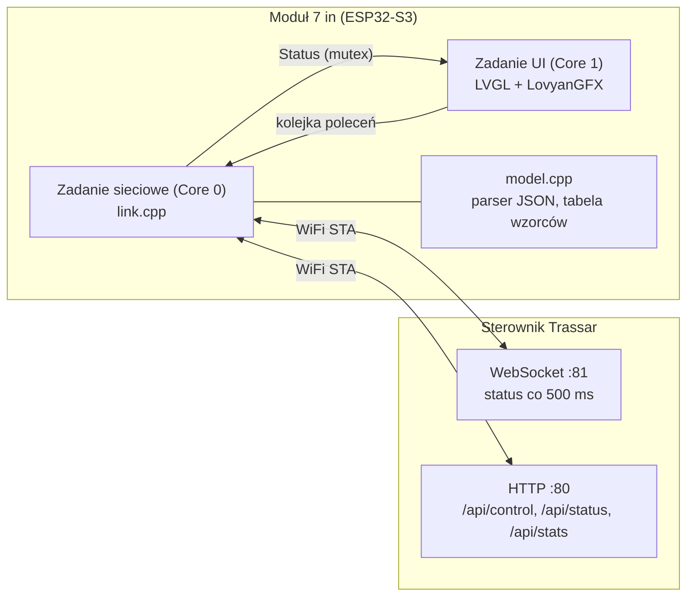

# Moduł wyświetlacza 7" — dokumentacja techniczna

Projekt: `display-module/` · wersja 0.1.0 · płytka **Sunton ESP32-8048S070C** (ESP32-S3, 800×480 RGB, GT911)
Framework: Arduino (PlatformIO, `espressif32@6.3.1`), grafika: **LVGL 8.3** + **LovyanGFX 1.1.x**

Opis dla operatora: [INSTRUKCJA_OBSLUGI.md](INSTRUKCJA_OBSLUGI.md), rozdz. 3. Schemat i piny: [SCHEMAT_PODLACZEN.md](SCHEMAT_PODLACZEN.md), rozdz. 5.

## 1. Koncepcja

Moduł jest **klientem WiFi** sterownika Trassar i wyłącznie panelem operatora. **Nie steruje pistoletami** i nie
jest elementem bezpieczeństwa. Wynika to z dwóch decyzji:

1. **Sprzęt** — panel RGB 800×480 zajmuje niemal wszystkie GPIO ESP32-S3, więc nie da się go dołączyć do płyty
   sterownika (zajętej przez pistolety, SPI, I2C, enkoder). Osobny moduł jest prostszy i bezpieczniejszy.
2. **Bezpieczeństwo** — sterowanie pistoletami pozostaje w sprawdzonym firmware sterownika. Moduł używa
   istniejącego API (te same polecenia co panel WWW i aplikacja Android), więc nie wymaga zmian po stronie
   sterownika poza jednym dodanym polem `patDist` w statusie.



## 2. Struktura projektu

```
display-module/
├── platformio.ini              # płytka, biblioteki, flagi (LVGL: -DLV_CONF_INCLUDE_SIMPLE)
├── README.md                   # skrót
└── src/
    ├── main.cpp                # setup/loop: LovyanGFX, LVGL, dotyk, start zadań
    ├── lgfx_sunton7.h          # konfiguracja panelu RGB, podświetlenia i dotyku GT911
    ├── lv_conf.h               # konfiguracja LVGL (16 bit, czcionki 12–48, wyłączone zbędne widgety)
    ├── app_config.h            # SSID, IP, porty, LINK_STALE_MS, ANIM_PERIOD_MS
    ├── settings_store.h        # ustawienia w NVS: hasło WiFi, jasność
    ├── model.h/.cpp            # struktury Status/StatsData/SlotCfg, parsery JSON, tabela PATTERNS
    ├── link.h/.cpp             # WiFi STA + WebSocket + HTTP + kolejka poleceń (zadanie FreeRTOS)
    ├── ui_common.h             # paleta, deklaracje pomocnicze, widgety
    ├── ui_core.cpp             # konstruktory (przycisk, etykieta), nakładki, toast, STOP na warstwie top
    ├── ui_widgets.cpp          # 7-segment, widok drogi w perspektywie, miniatura wzorca
    ├── ui_main.cpp             # ekran roboczy + timer odświeżania (33 ms)
    ├── ui_overlays.cpp         # wybór wzorca, menu, hasło WiFi, informacje
    └── ui_overlays2.cpp        # statystyki, ustawienia, kalibracja, farba, edytor wzorca własnego
```

## 3. Budowanie i wgranie

Dwa środowiska PlatformIO — ten sam kod, różna orientacja interfejsu:

| Środowisko | Ekran | Opis |
|------------|-------|------|
| `sunton7` (domyślne) | poziomo 800 × 480 | układ z kolumnami wzorców po bokach ekranu |
| `sunton7_portrait` | pionowo 480 × 800 | panel pionowy — klawisze fizyczne obok etykiet wzorców ([WIZUALIZACJE.md](WIZUALIZACJE.md), propozycja C) |

```bash
cd display-module
pio run                              # kompilacja poziomo (Flash ≈ 19 %, RAM ≈ 15 %)
pio run -e sunton7_portrait          # kompilacja pionowo
pio run -e sunton7_portrait -t upload  # wgranie wersji pionowej przez USB (CH340)
pio device monitor                   # 115200
```

**Orientacja pionowa:** flaga `-DUI_PORTRAIT=1` (ustawiona w środowisku `sunton7_portrait`) zmienia rozdzielczość interfejsu
na 480 × 800 (`SCR_W`, `SCR_H` w `app_config.h`), włącza obrót panelu (`gfx.setRotation(UI_ROTATION)`) i pionowe układy
ekranu roboczego oraz wszystkich okien. Jeśli obraz jest odwrócony o 180°, zmień `-DUI_ROTATION=1` na `3` w `platformio.ini`.
Dotyk korzysta z obrotu LovyanGFX (współrzędne dotyku są przeliczane razem z obrotem obrazu).

Wymagania: Python 3, PlatformIO Core (lub rozszerzenie PlatformIO IDE w VS Code). Pierwsza kompilacja pobiera
toolchain ESP32 i biblioteki (~1–2 GB).

Kluczowe ustawienia (`platformio.ini`): `board = esp32-s3-devkitc-1`, `memory_type = qio_opi` (PSRAM oktalny),
Flash 16 MB, `partitions = default_16MB.csv`, `-DARDUINO_LOOP_STACK_SIZE=16384`.

## 4. Model wątków

| Zadanie | Rdzeń | Rola |
|---------|-------|------|
| `loop()` (Arduino) | Core 1 | `lv_timer_handler()` co 5 ms — rysowanie, dotyk, timery UI |
| `net` (FreeRTOS, stos 10 KB, priorytet 2) | Core 0 | WiFi, WebSocket, HTTP, kolejka poleceń |

Wymiana danych:
- **Status → UI:** zadanie `net` parsuje ramki JSON i zapisuje `Status` pod mutexem (`storeStatus`); UI kopiuje go
  (`linkGetStatus`). UI nigdy nie wykonuje operacji sieciowych.
- **UI → sterownik:** UI wstawia polecenie do kolejki FreeRTOS (`linkSend`, 8 pozycji); zadanie `net` wysyła
  je przez `POST /api/control`. Wynik (`ok` lub komunikat błędu) trafia do `linkResultSeq/Ok/Msg` i jest
  wyświetlany jako komunikat u góry ekranu.
- **STOP:** `urgent = true` → `xQueueSendToFront` (najpierw w kolejce); przy pełnej kolejce zwalnia najstarsze
  polecenie; do 4 prób POST oraz ponowienie przy HTTP 503. Po nieudanej próbie: komunikat „STOP NIE DOTARŁ".

## 5. Warstwa sieciowa (`link.cpp`)

**Stany łącza** (`LinkState`): `LS_NO_PASSWORD` → `LS_WIFI_CONNECTING` → `LS_NO_DATA` → `LS_ONLINE`.

- WiFi w trybie STA, `setSleep(false)`, auto-reconnect; ponowna próba `WiFi.begin()` co 8 s przy braku połączenia.
- **WebSocket** `ws://192.168.4.1:81` z heartbeatem (ping co 4 s, timeout 2 s, 2 błędy → rozłączenie), reconnect co 2 s.
- **Fallback HTTP:** jeśli przez > 1,5 s brak ramek, `GET /api/status` co 700 ms.
- **ONLINE** = ramka statusu młodsza niż `LINK_STALE_MS` (2,5 s). W przeciwnym razie UI pokazuje nakładkę
  „BRAK ŁĄCZNOŚCI" i blokuje polecenia (poza próbą STOP).
- `GET /api/stats` co 1,5 s tylko gdy otwarte jest okno wymagające statystyk (`linkWantStats`).
- Konfiguracja wzorca własnego: `POST get_slot_config` na żądanie (`linkRequestSlot` / `linkGetSlot`).

Hasło AP sterownika = ostatnie 4 bajty MAC (8 znaków HEX). Moduł zapisuje je w NVS (`settings_store.h`).

## 6. Model danych (`model.cpp`)

- `parseStatus()` — deserializacja JSON (ArduinoJson 7). Wartości liczbowe akceptowane zarówno jako liczby, jak i tekst.
  Ramka bez pola `state` (np. `{}`) jest odrzucana.
- `PATTERNS[15]` — **kopia tabeli z `src/patterns.cpp` sterownika** (kody, nazwy, konfiguracja pistoletów). Zmiana
  wzorców w sterowniku wymaga zmiany także tutaj.
- `effectiveGun()` / `patternGun()` — konfiguracja pistoletu z uwzględnieniem odwrócenia P1 ↔ P3 i wzorca własnego
  (z `customGuns` w statusie).
- Geometria wizualizacji: `GUN_LATERAL[]` (położenie poprzeczne pasa jako ułamek szerokości jezdni) i
  `GUN_WIDTH_FR[]` (szerokość pasa). Wartości są **umowne (poglądowe)** — nie odwzorowują fizycznego rozstawu
  pistoletów; do zmiany bez skutków dla sterowania.

## 7. Interfejs

### 7.1 Zasady

- Układ 800×480 (poziomo) lub 480×800 (pionowo, `-DUI_PORTRAIT=1`); elementy dotykowe co najmniej ok. 60 px wysokości;
  paleta wysokokontrastowa (`ui_common.h`).
- **Układ pionowy:** kolumny wzorców (5 + 5, szer. 108 px, wys. 106 px, krok 116 px, od y = 106) stoją przy lewej i prawej
  krawędzi ekranu, więc fizyczny klawisz S1–S10 przy krawędzi leży na tej samej wysokości co etykieta. Zakładki OŚ JEZDNI /
  KRAWĘDŹ są pod paskiem górnym, środek (244 px) zawiera kod wzorca, prędkość, liczniki, widok drogi i kapsuły pistoletów, na dole
  tryby, START OD PRZERWY, START i STOP. Okna (menu, wzorce, statystyki, ustawienia, kalibracja, farba, edytor wzorca własnego,
  WiFi) mają osobne układy pionowe (`#if UI_PORTRAIT`): nagłówek z STOP i ZAMKNIJ w jednym wierszu, tytuł niżej, zawartość od
  `OV_TOP`.
- Tekst wyłącznie ASCII (wbudowane czcionki Montserrat nie mają polskich znaków).
- Jeden ekran roboczy (`ui_main.cpp`) + **nakładki pełnoekranowe** (`uiOverlay()`), z których zawsze widoczny jest
  **STOP** (lewy górny róg, warstwa `lv_layer_top`) i **ZAMKNIJ**.
- Timer główny co 33 ms odczytuje status i aktualizuje widgety; setery pomijają zmiany, gdy wartość jest taka sama
  (mniej odrysowań).

### 7.2 Widgety własne (`ui_widgets.cpp`)

| Widget | Opis |
|--------|------|
| 7-segment (`uiSevenSeg`) | Cyfry rysowane prostokątami, wygaszone segmenty jako cień; kolor zależny od alarmów. |
| Droga (`uiRoadView`) | Perspektywa: `t(d) = (d+1)/((d+1)+3) / normalizacja`, zasięg 22 m do przodu i 1 m wstecz; pasy jako wielokąty (`lv_draw_polygon`). Kolor: namalowane = żółty, plan = ciemnożółty (70 %), pistolet strzelający wg statusu = jasnozielony blok. |
| Miniatura (`uiGlyph`) | Widok z góry, ok. 10 m cyklu wzorca, do siatki wyboru i przycisków bocznych. |

### 7.3 Synchronizacja animacji

Sterownik zwraca `patDist` (dystans od startu wzorca). Moduł ekstrapoluje między ramkami (co 500 ms):

```
patDistNow = patDist + (speed_kmh / 3.6) * wiek_ramki_s      (tylko gdy MALOWANIE, wiek < 1,2 s)
```

Pistolet przerywany strzela, gdy `fmod(patDist, kreska+przerwa) < kreska` (ta sama reguła co
`shouldGunFirePure()` w sterowniku). Kreski w widoku drogi są rysowane na podstawie tej samej formuły, więc
pozycja w cyklu zgadza się z rzeczywistością (z dokładnością ekstrapolacji). Rzeczywisty stan pistoletów (zielone
bloki) pochodzi bezpośrednio z pola `guns` i jest źródłem prawdy. Przy starszym sterowniku bez `patDist` używany
jest dystans sesji (przybliżenie).

### 7.4 Strony wzorców OŚ / KRAWĘDŹ

Boczne kolumny (5 + 5 przycisków S1–S10) pokazują wzorce aktywnej **grupy**:

| Grupa | S1…S10 |
|-------|--------|
| OŚ (0) | P-1a, P-1b, P-1c, P-1d, P-1e, P-2a, P-2b, P-3a, P-3b, P-4 |
| KRAWĘDŹ (1) | P-6, P-7a, P-7b, P-7c, P-7d, WŁASNY, —, —, —, — |

- Mapowanie `softKeyPattern(grupa, klawisz)` w `model.cpp` jest **kopią `src/pattern_layout.h` sterownika** —
  zmieniać oba miejsca razem (test jednostkowy w `test/test_native`).
- Grupa jest **jednym źródłem prawdy w sterowniku** (`patGroup` w statusie): sterują nią fizyczny przycisk GRUPA,
  przełącznik OŚ/KRAWĘDŹ na ekranie (`set_pattern_group`) i automatyczne podążanie za wybranym wzorcem. Ekran po dotknięciu
  zakładki pokazuje wybór natychmiast (nadpisanie na 1,5 s), po czym przyjmuje wartość ze sterownika.
- Starszy sterownik bez `patGroup`: strona wyznaczana lokalnie z aktualnego wzorca.
- Układ fizycznych przycisków (klasyczny 15 / soft-key 10 + GRUPA) przełącza się w MENU → USTAWIENIA
  (`set_pattern_layout`); nie zmienia wyglądu ekranu — strony OŚ/KRAWĘDŹ są zawsze dostępne dotykiem.

### 7.5 Ustawienia lokalne (NVS, przestrzeń `mpddisp`)

| Klucz | Znaczenie |
|-------|-----------|
| `wpass` | hasło WiFi sterownika |
| `bright` | jasność podświetlenia (20–255) |

## 8. Dodawanie funkcji

| Zadanie | Gdzie |
|---------|-------|
| Nowe pole statusu | `model.h` (struktura), `model.cpp` (`parseStatus`), sterownik `web_server.cpp` (`getStateJson`) |
| Nowe polecenie | `uiSend("action=...")` z UI; obsługa w sterowniku w `handleControl()` |
| Nowe okno | funkcja `uiOpenXxx()` w `ui_overlays*.cpp` (`uiOverlay(tytuł, fn_odświeżania)`), pozycja w menu w `ui_overlays.cpp` |
| Zmiana układu ekranu roboczego | stałe na początku `ui_main.cpp` |
| Zmiana wyglądu wzorców/drogi | `ui_widgets.cpp`, `GUN_LATERAL` / `GUN_WIDTH_FR` w `model.cpp` |
| Zmiana taktowania/piny panelu | `lgfx_sunton7.h` |

Konwencje: nazwy w kodzie po angielsku (camelCase), teksty UI po polsku ASCII; brak komentarzy poza
uzasadnieniem niejawnych ograniczeń.

## 9. Ograniczenia i plany

- Brak polskich znaków (własna czcionka LVGL — do dodania przez `lv_font_conv`).
- Brak w module: pobieranie raportów SD, czyszczenie dysz, pomiar dystansu, reset etapu/liczników, eksport
  statystyk, factory reset, tryb nocny, wybór DEMO — dostępne na sterowniku i w panelu WWW.
- Tryb RĘCZNY wymaga fizycznego START na sterowniku (zabezpieczenie sprzętowe, celowe).
- Przyciski fizyczne S1–S10 + GRUPA (soft-key) są podłączone do MCP23017 **sterownika** (nie do modułu 7"); moduł tylko
  wyświetla etykiety obok nich. Rozmieszczenie mechaniczne — przy projekcie obudowy.
- Weryfikacja na sprzęcie: firmware kompiluje się poprawnie; ustawienia panelu (timingi, piny) pochodzą z
  dokumentacji społeczności i wymagają potwierdzenia na egzemplarzu.
- Sygnał dźwiękowy z modułu — brak (alarmy słychać z buzzera sterownika).
