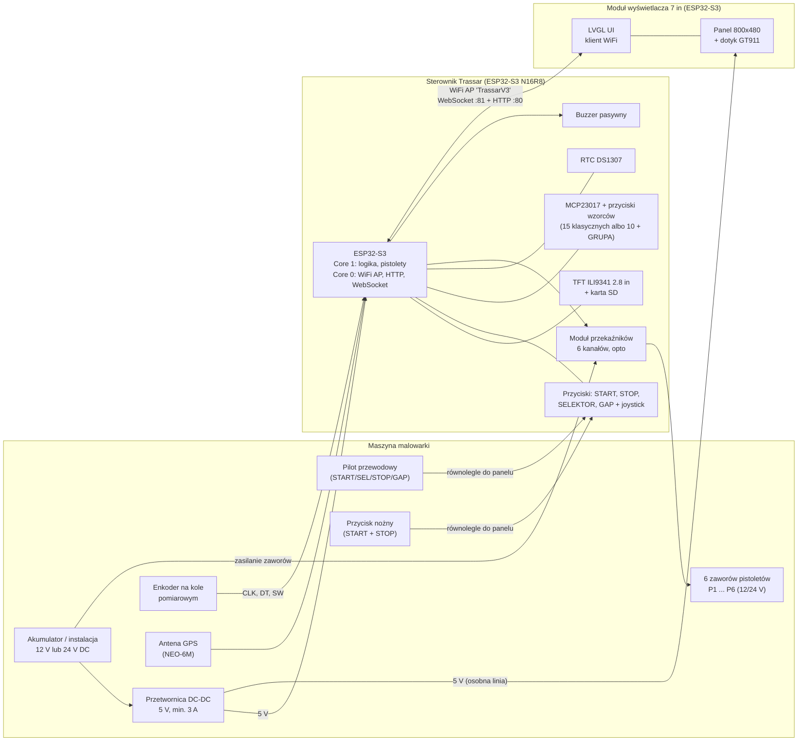
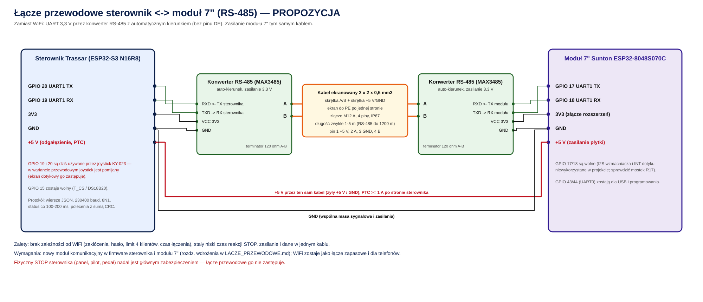
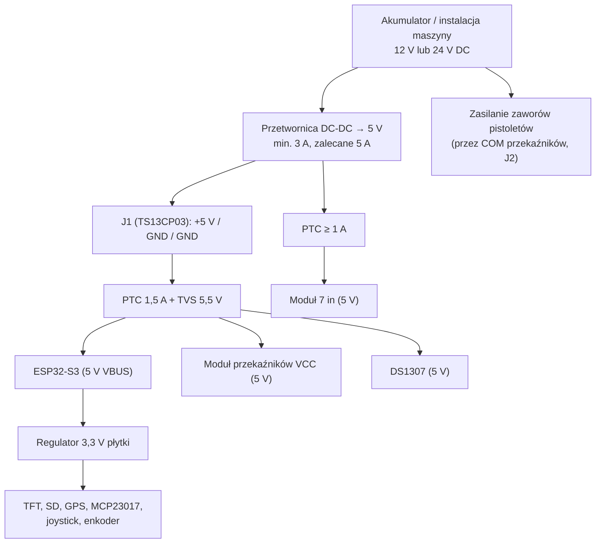
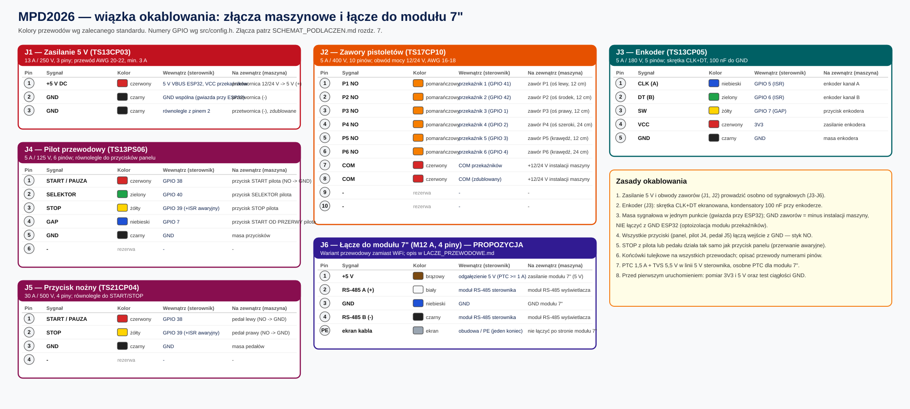
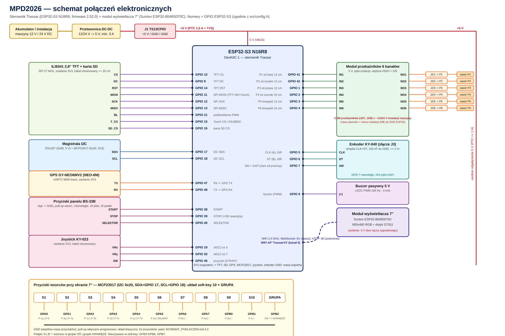

# MPD2026 — Schemat połączeń i dokumentacja sprzętowa

**Dotyczy:** sterownik Trassar (firmware 2.52.0) + moduł wyświetlacza 7" (display-module 0.1.0)
**Źródło prawdy dla pinów:** `src/config.h`, `platformio.ini`, `src/temp_sensor.h`, `display-module/src/lgfx_sunton7.h`

> Diagramy oznaczone `mermaid` renderują się automatycznie na GitHub (w VS Code wymagają rozszerzenia
> *Markdown Preview Mermaid Support*). Schematy pinów w blokach kodu są czytelne wszędzie.

## Spis treści

1. [Architektura systemu](#1-architektura-systemu)
2. [Lista materiałów (BOM)](#2-lista-materiałów-bom)
3. [Sterownik: mapa GPIO](#3-sterownik-mapa-gpio)
4. [Sterownik: schematy modułów](#4-sterownik-schematy-modułów)
5. [Moduł wyświetlacza 7"](#5-moduł-wyświetlacza-7)
6. [Zasilanie](#6-zasilanie)
7. [Złącza maszynowe J1–J5](#7-złącza-maszynowe-j1j5)
8. [Kompletny diagram okablowania](#8-kompletny-diagram-okablowania)
9. [Przewody, złącza, zabezpieczenia](#9-przewody-złącza-zabezpieczenia)
10. [Checklist montażowy i diagnostyka](#10-checklist-montażowy-i-diagnostyka)
11. [Bezpieczeństwo sprzętowe](#11-bezpieczeństwo-sprzętowe)

---

## 1. Architektura systemu

System składa się z **dwóch urządzeń** połączonych bezprzewodowo. Sterownik jest jedynym urządzeniem
sterującym pistoletami; moduł 7" jest panelem operatora (nie ma żadnego przewodowego połączenia sygnałowego
ze sterownikiem — tylko zasilanie).



### Kanały komunikacji

| Kanał | Medium | Protokół | Kierunek |
|-------|--------|----------|----------|
| Status na żywo | WiFi (AP sterownika) | WebSocket `ws://192.168.4.1:81`, JSON co 500 ms | sterownik → moduł 7" / telefon |
| Polecenia | WiFi | HTTP `POST /api/control` (form-urlencoded) | moduł 7" / telefon → sterownik |
| Statystyki, konfiguracja | WiFi | HTTP `GET /api/stats`, `POST get_slot_config` | dwukierunkowo |
| Raporty, trasy GPS | WiFi | HTTP (pobieranie plików z karty SD) | sterownik → telefon/PC |

Szczegóły API: [API_WWW.md](API_WWW.md). Moduł 7": [MODUL_WYSWIETLACZA.md](MODUL_WYSWIETLACZA.md).

---

## 2. Lista materiałów (BOM)

### 2.1 Sterownik

| # | Komponent | Model | Ilość | Uwagi |
|---|-----------|-------|-------|-------|
| 1 | Mikrokontroler | ESP32-S3 N16R8 DevKitC-1 | 1 | 16 MB Flash, 8 MB Octal PSRAM, USB-C |
| 2 | Wyświetlacz | ILI9341 2.8" TFT SPI 240×320 (z SD i Touch) | 1 | Slot MicroSD na module |
| 3 | Karta pamięci | MicroSD FAT32, min. 1 GB, klasa 4+ | 1 | Raporty, trasy, backup NVS |
| 4 | Zegar RTC | DS1307 AT24C32 (moduł z gniazdem CR2032) | 1 | I2C 0x68, zasilanie 5 V |
| 5 | Bateria RTC | CR2032 | 1 | |
| 6 | Enkoder | KY-040 / HW-040 (inkrementalny + przycisk SW) | 1 | 5-pin, na kole pomiarowym |
| 7 | Przyciski sterujące | BS-33B monostabilne NO | 3 | START, STOP, SELEKTOR (panel) |
| 8 | Ekspander I/O | MCP23017 DIP-28 | 1 | I2C 0x20, zasilanie 3,3 V |
| 9 | Przyciski wzorców | Monostabilne NO, montaż panelowy | 15 (układ klasyczny) albo **11** (soft-key: 10 + GRUPA) | Klasyczny: po jednym na wzorzec P-1a … P-7d. Soft-key: S1–S10 przy krawędziach ekranu 7" + GRUPA |
| 10 | Moduł przekaźników | 6-kanałowy 5 V, opto-izolowany, SRD-05VDC-SL-C | 1 | Wejścia aktywne stanem HIGH |
| 11 | GPS | GY-NEO6MV2 (u-blox NEO-6M + antena) | 1 | UART2, 9600 baud |
| 12 | Joystick | KY-023 analogowy 2-osiowy + przycisk | 1 | 3,3 V |
| 13 | Buzzer | Pasywny 5 V (np. TMB12A05) | 1 | Sterowany PWM |
| 14 | Czujnik temperatury (opcja) | DS18B20 + rezystor 4,7 kΩ | 0–1 | GPIO 15 |
| 15 | Przetwornica DC-DC | 12/24 V → 5 V, min. 3 A | 1 | Na maszynie |
| 16 | Zawory pistoletów | Elektromagnetyczne 12/24 V DC | 6 | Zasilane z instalacji maszyny |
| 17 | Złącza maszynowe | J1 TS13CP03, J2 TS17CP10, J3 TS13CP05, J4 TS13PS06, J5 TS21CP04 | po 1 | Patrz [sekcja 7](#7-złącza-maszynowe-j1j5) |
| 18 | Kondensatory | 100 nF ceramiczne | 2+ | Filtr CLK/DT enkodera |
| 19 | Bezpiecznik | PTC 1,5 A (linia 5 V) + dioda TVS 5,5 V | 1+1 | Zalecane |

### 2.2 Moduł wyświetlacza 7"

| # | Komponent | Model | Ilość | Uwagi |
|---|-----------|-------|-------|-------|
| 1 | Płytka z wyświetlaczem | **Sunton ESP32-8048S070C** (ESP32-S3, 7" IPS 800×480 RGB, dotyk pojemnościowy GT911, 8 MB PSRAM OPI, 16 MB Flash) | 1 | Wariant „C" = dotyk; „N" = bez dotyku |
| 2 | Zasilanie | 5 V DC (USB-C lub gniazdo zasilania płytki), osobne odgałęzienie ≥ 1 A | 1 | Patrz [sekcja 6](#6-zasilanie) |
| 3 | Obudowa | Do wykonania (druk 3D na prototyp, potem aluminium) | 1 | Osobny etap projektu |

---

## 3. Sterownik: mapa GPIO

> **UWAGA:** GPIO 26–37 są zajęte przez Flash i Octal PSRAM w wariancie N16R8 — **nie podłączać niczego**.
> GPIO 46 (joystick SW) jest pinem strapping — **nie wciskać joysticka przy włączaniu zasilania**.

| GPIO | Funkcja | Typ | Uwagi |
|------|---------|-----|-------|
| 1 | Przekaźnik P3 (oś prawy, 12 cm) | OUTPUT | HIGH = pistolet ON |
| 2 | Przekaźnik P4 (oś szeroki, 24 cm) | OUTPUT | |
| 3 | Przekaźnik P5 (krawędź wąska, 12 cm) | OUTPUT | |
| 4 | Przekaźnik P6 (krawędź szeroka, 24 cm) | OUTPUT | |
| 5 | Enkoder CLK (A) | INPUT_PULLUP | ISR na CHANGE |
| 6 | Enkoder DT (B) | INPUT_PULLUP | ISR na CHANGE |
| 7 | Przycisk GAP (SW enkodera) | INPUT_PULLUP | Start od przerwy |
| 8 | Buzzer | PWM (LEDC kanał 1) | |
| 9 | TFT DC | OUTPUT | |
| 10 | TFT CS | OUTPUT | |
| 11 | SPI MOSI | OUTPUT | Wspólny: TFT, SD, Touch |
| 12 | SPI SCK | OUTPUT | Wspólny: TFT, SD, Touch |
| 13 | SPI MISO | INPUT | Wspólny: TFT, SD, Touch |
| 14 | TFT RST | OUTPUT | |
| 15 | Touch CS / czujnik DS18B20 | OUTPUT / 1-Wire | Współdzielony (dotyk TFT nieużywany w UI) |
| 16 | SD CS | OUTPUT | Ustawiany na HIGH przed inicjalizacją TFT |
| 17 | I2C SDA | I/O | RTC DS1307 + MCP23017 |
| 18 | I2C SCL | OUTPUT | RTC DS1307 + MCP23017 |
| 19 | Joystick VRx | ADC2 | Oś pozioma |
| 20 | Joystick VRy | ADC2 | Oś pionowa |
| 21 | TFT podświetlenie | PWM (LEDC kanał 0) | 5 kHz, 8 bit |
| 26–37 | **ZAJĘTE (Flash + Octal PSRAM)** | — | **Nie używać** |
| 38 | Przycisk START | INPUT_PULLUP | |
| 39 | Przycisk STOP | INPUT_PULLUP | Dodatkowo ISR awaryjnego stopu (FALLING) |
| 40 | Przycisk SELEKTOR | INPUT_PULLUP | |
| 41 | Przekaźnik P1 (oś lewy, 12 cm) | OUTPUT | |
| 42 | Przekaźnik P2 (oś środek, 12 cm) | OUTPUT | |
| 43 / 44 | UART0 TX / RX (USB-serial) | — | Monitor szeregowy |
| 46 | Joystick SW | INPUT_PULLUP | **Strap pin** |
| 47 | GPS RX (ESP32 RX ← GPS TX) | UART2 | 9600 baud |
| 48 | GPS TX (ESP32 TX → GPS RX) | UART2 | |
| 0, 45 | Wolne | — | Strap piny — unikać |

### 3.1 Fizyczny pinout ESP32-S3 DevKitC-1 (widok z góry, USB-C na dole)

```
                        ┌──────────────┐
                        │   ESP32-S3   │
                        │    N16R8     │
                        │  DevKitC-1   │
   ─────────────────────┤              ├─────────────────────
   Pin# │ Funkcja       │              │ Funkcja       │ Pin#
   ─────┤───────────────┤              ├───────────────┤─────
    1   │ 3V3           │              │ GND           │  1
    2   │ 3V3           │              │ TX (GPIO 43)  │  2
    3   │ RST           │              │ RX (GPIO 44)  │  3
    4   │ GPIO 4  [P6]  │              │ GPIO 1  [P3]  │  4
    5   │ GPIO 5  [CLK] │              │ GPIO 2  [P4]  │  5
    6   │ GPIO 6  [DT]  │              │ GPIO 42 [P2]  │  6
    7   │ GPIO 7  [GAP] │              │ GPIO 41 [P1]  │  7
    8   │ GPIO 15 [T_CS]│              │ GPIO 40 [SEL] │  8
    9   │ GPIO 16 [SDCS]│              │ GPIO 39 [STOP]│  9
   10   │ GPIO 17 [SDA] │              │ GPIO 38 [START]│ 10
   11   │ GPIO 18 [SCL] │              │ GPIO 37  PSRAM│ 11
   12   │ GPIO 8  [BUZ] │              │ GPIO 36  PSRAM│ 12
   13   │ GPIO 3  [P5]  │              │ GPIO 35  PSRAM│ 13
   14   │ GPIO 46 [JSW] │              │ GPIO 0        │ 14
   15   │ GPIO 9  [DC]  │              │ GPIO 45       │ 15
   16   │ GPIO 10 [CS]  │              │ GPIO 48 [GPS TX]│16
   17   │ GPIO 11 [MOSI]│              │ GPIO 47 [GPS RX]│17
   18   │ GPIO 12 [SCK] │              │ GPIO 21 [BL]  │ 18
   19   │ GPIO 13 [MISO]│              │ GPIO 20 [VRy] │ 19
   20   │ GPIO 14 [RST] │              │ GPIO 19 [VRx] │ 20
   21   │ 5V (VBUS)     │              │ GND           │ 21
   22   │ GND           │              │ GND           │ 22
   ─────┤───────────────┤              ├───────────────┤─────
                        │  ┌────────┐  │
                        │  │ USB-C  │  │
                        │  └────────┘  │
                        └──────────────┘
```

---

## 4. Sterownik: schematy modułów

### 4.1 Wyświetlacz ILI9341 + karta SD (wspólna magistrala SPI)

```
   ESP32-S3                        Moduł ILI9341 2.8" (14-pin)
   ─────────                       ───────────────────────────
   3V3  ───────────────────────────  VCC
   GND  ───────────────────────────  GND
   GPIO 10 ────────────────────────  CS
   GPIO 14 ────────────────────────  RESET
   GPIO  9 ────────────────────────  DC / RS
   GPIO 11 ────────────────────────  SDI (MOSI)  ─┬─ T_DIN, SD_MOSI (wspólne)
   GPIO 12 ────────────────────────  SCK         ─┼─ T_CLK, SD_SCK  (wspólne)
   GPIO 13 ────────────────────────  SDO (MISO)  ─┴─ T_DO,  SD_MISO (wspólne)
   GPIO 21 ────────────────────────  LED (podświetlenie, PWM)
   GPIO 15 ────────────────────────  T_CS (Touch CS)
   GPIO 16 ────────────────────────  SD_CS (karta SD)
                                     T_IRQ — niepodłączony
```

Częstotliwość SPI: 27 MHz (zapis), 16 MHz (odczyt). Każde urządzenie ma osobny CS; przed inicjalizacją TFT
firmware ustawia `SD_CS = HIGH`, aby karta nie reagowała na ruch przeznaczony dla wyświetlacza.
Przewody SPI: ekranowane, max 15–20 cm.

### 4.2 Magistrala I2C: DS1307 + MCP23017

```
                     ┌──────────────────────────────────────────────┐
   ESP32-S3          │           Wspólna magistrala I2C             │
   GPIO 17 (SDA) ────┴──────┬───────────────────────┬───────────────┘
   GPIO 18 (SCL) ────┬──────┼───────────┬───────────┘
                     │      │           │
                ┌────┴──────┴───┐  ┌────┴───────────┐
                │ DS1307 (0x68) │  │ MCP23017 (0x20)│
                │ VCC = 5 V     │  │ VDD = 3,3 V    │
                │ + bateria     │  │ A0=A1=A2=GND   │
                │   CR2032      │  │ RESET = 3,3 V  │
                └───────────────┘  └────────────────┘
   Pull-up 4,7 kΩ na SDA/SCL są na module DS1307.
```

### 4.3 MCP23017 — przyciski wzorców (układ klasyczny 15 lub soft-key 10 + GRUPA)

Każdy przycisk: jeden styk do pinu MCP23017, drugi do GND. Pull-up włączane programowo (bez rezystorów
zewnętrznych). Skan co 20 ms z debounce (dwa zgodne odczyty). Wybór układu: moduł 7" (MENU → USTAWIENIA →
*Przyciski wzorców*) lub polecenie `set_pattern_layout` (0 = klasyczny, 1 = soft-key); zapis w NVS sterownika.
Okablowanie MCP23017 jest wspólne — zmienia się tylko liczba zamontowanych przycisków i ich znaczenie.

#### Układ soft-key: 11 przycisków (zalecany przy module 7")

```
        ┌────────────────────── ekran 7" ──────────────────────┐
   S1 ◄─┤ etykieta P-1a / P-6                 etykieta P-2a / WŁASNY ├─► S6
   S2 ◄─┤ etykieta P-1b / P-7a                etykieta P-2b          ├─► S7
   S3 ◄─┤ etykieta P-1c / P-7b                etykieta P-3a          ├─► S8
   S4 ◄─┤ etykieta P-1d / P-7c                etykieta P-3b          ├─► S9
   S5 ◄─┤ etykieta P-1e / P-7d                etykieta P-4           ├─► S10
        └───────────────────────────────────────────────────────────┘
                                 [ GRUPA OŚ/KRAWĘDŹ ]   (np. przy narożniku ekranu)
```

| Przycisk | Pin MCP23017 | Bit | Wzorzec — grupa OŚ | Wzorzec — grupa KRAWĘDŹ |
|----------|--------------|-----|--------------------|--------------------------|
| S1 | GPA0 (pin 21) | 0 | P-1a | P-6 |
| S2 | GPA1 (22) | 1 | P-1b | P-7a |
| S3 | GPA2 (23) | 2 | P-1c | P-7b |
| S4 | GPA3 (24) | 3 | P-1d | P-7c |
| S5 | GPA4 (25) | 4 | P-1e | P-7d |
| S6 | GPA5 (26) | 5 | P-2a | WŁASNY |
| S7 | GPA6 (27) | 6 | P-2b | — |
| S8 | GPA7 (28) | 7 | P-3a | — |
| S9 | GPB0 (1) | 8 | P-3b | — |
| S10 | GPB1 (2) | 9 | P-4 | — |
| **GRUPA** | **GPB2 (3)** | 10 | przełącza OŚ ⇄ KRAWĘDŹ | |

Piny GPB3–GPB6 (pozycje 4–7) są w układzie soft-key nieużywane. Przycisk GRUPA daje krótki ton 1,8 kHz;
aktywna grupa jest zapamiętywana w RAM i **podąża za wybranym wzorcem** (zmiana wzorca z panelu WWW lub ekranu 7"
przełącza grupę). Etykiety wzorców na ekranie 7" są zawsze zgodne z aktualną grupą.

#### Układ klasyczny: 15 przycisków (domyślny, działa bez modułu 7")

Jeden przycisk na wzorzec — tabela poniżej.

```
   MCP23017 DIP-28 (widok z góry)
              ┌─────∪─────┐
   P-3b GPB0 ─┤1        28├─ GPA7  P-3a
   P-4  GPB1 ─┤2        27├─ GPA6  P-2b
   P-6  GPB2 ─┤3        26├─ GPA5  P-2a
   P-7a GPB3 ─┤4        25├─ GPA4  P-1e
   P-7b GPB4 ─┤5        24├─ GPA3  P-1d
   P-7c GPB5 ─┤6        23├─ GPA2  P-1c
   P-7d GPB6 ─┤7        22├─ GPA1  P-1b
   (wolny)GPB7┤8        21├─ GPA0  P-1a
        3,3 V ┤9  VDD   20├─ INTA  (nieużywany)
          GND ┤10 VSS   19├─ INTB  (nieużywany)
              ┤11 NC    18├─ RESET ──── 3,3 V
  GPIO 18 SCL ┤12       17├─ A2 ──── GND
  GPIO 17 SDA ┤13       16├─ A1 ──── GND
              ┤14 NC    15├─ A0 ──── GND
              └───────────┘
   Adres I2C: 0x20
```

| Pin MCP | Wzorzec | Pin MCP | Wzorzec |
|---------|---------|---------|---------|
| GPA0 (21) | P-1a | GPB0 (1) | P-3b |
| GPA1 (22) | P-1b | GPB1 (2) | P-4 |
| GPA2 (23) | P-1c | GPB2 (3) | P-6 |
| GPA3 (24) | P-1d | GPB3 (4) | P-7a |
| GPA4 (25) | P-1e | GPB4 (5) | P-7b |
| GPA5 (26) | P-2a | GPB5 (6) | P-7c |
| GPA6 (27) | P-2b | GPB6 (7) | P-7d |
| GPA7 (28) | P-3a | GPB7 (8) | nieużywany |

### 4.4 Przyciski sterujące i enkoder

```
   ESP32-S3                         Element
   ─────────                        ───────
   GPIO 38 ──┬── BS-33B START ───── GND
             ├── J4 pin 1 (pilot) ─ GND
             └── J5 pin 1 (nożny) ─ GND
   GPIO 39 ──┬── BS-33B STOP ────── GND
             ├── J4 pin 3 (pilot) ─ GND
             └── J5 pin 2 (nożny) ─ GND
   GPIO 40 ──┬── BS-33B SELEKTOR ── GND
             └── J4 pin 2 (pilot) ─ GND
   GPIO  7 ──┬── Enkoder SW ─────── GND
             └── J4 pin 4 (pilot) ─ GND

   GPIO  5 ─────── Enkoder CLK (A) ──[100 nF]── GND   (skrętka CLK+DT)
   GPIO  6 ─────── Enkoder DT  (B) ──[100 nF]── GND
   3V3     ─────── Enkoder VCC (opcjonalnie)
   GND     ─────── Enkoder GND
```

Wszystkie wejścia używają wewnętrznych rezystorów pull-up (aktywny stan niski). Pilot i przycisk nożny są
podłączone **równolegle** do przycisków panelowych i nie wymagają zmian w firmware. Debounce 50 ms,
długie naciśnięcie 1,5 s.

### 4.5 Joystick KY-023

```
   KY-023        ESP32-S3
   ──────        ────────
   GND    ────── GND
   +5V    ────── 3V3        (zasilanie 3,3 V — bezpieczny zakres ADC)
   VRx    ────── GPIO 19    (ADC2, oś pozioma)
   VRy    ────── GPIO 20    (ADC2, oś pionowa)
   SW     ────── GPIO 46    (INPUT_PULLUP; STRAP PIN — nie wciskać przy starcie!)
```
Kabel ekranowany, max 50 cm. Strefa martwa ±500, histereza 150 (ADC 12-bit).

### 4.6 GPS GY-NEO6MV2

```
   GY-NEO6MV2     ESP32-S3
   ──────────     ────────
   VCC     ────── 3V3
   GND     ────── GND
   TX      ────── GPIO 47 (RX)
   RX      ────── GPIO 48 (TX)
   Antena ceramiczna na kablu — nie skracać, wynieść na zewnątrz kabiny.
```
UART2, 9600 baud. Zimny start do ok. 35 s (do kilku minut w budynku).

### 4.7 Moduł przekaźników i zawory pistoletów

```
   ESP32-S3                  Moduł przekaźników 6 kanałów (5 V, opto)
   ────────                  ─────────────────────────────────────────
   GPIO 41 ─────────────────  IN1  ──►  Przekaźnik 1 (P1, 12 cm, oś lewy)
   GPIO 42 ─────────────────  IN2  ──►  Przekaźnik 2 (P2, 12 cm, oś środek)
   GPIO  1 ─────────────────  IN3  ──►  Przekaźnik 3 (P3, 12 cm, oś prawy)
   GPIO  2 ─────────────────  IN4  ──►  Przekaźnik 4 (P4, 24 cm, oś szeroki)
   GPIO  3 ─────────────────  IN5  ──►  Przekaźnik 5 (P5, 12 cm, krawędź)
   GPIO  4 ─────────────────  IN6  ──►  Przekaźnik 6 (P6, 24 cm, krawędź)
   5 V (VBUS) ──────────────  VCC
   GND ─────────────────────  GND

   Strona mocy (galwanicznie oddzielona od ESP32):

   +12/24 V z instalacji maszyny ──► COM przekaźników (J2 pin 7 i 8)
   NO przekaźnika n ────────────────► Zawór Pn ──► GND instalacji maszyny
   (masa zaworów NIE jest łączona z GND ESP32)
```

Wejścia aktywne stanem HIGH. Moduł ma wbudowane diody flyback i opto-izolację. Przy sześciu jednocześnie
aktywnych przekaźnikach cewki pobierają ok. 0,5 A — patrz [sekcja 6](#6-zasilanie).

### 4.8 Buzzer pasywny

```
   GPIO 8 ──────── Buzzer (+)      Buzzer (−) ──────── GND
   LEDC PWM kanał 1, wypełnienie 50 %, zakres 100 Hz – 5 kHz
```

### 4.9 Czujnik temperatury DS18B20 (opcjonalny)

```
   DS18B20            ESP32-S3
   ───────            ────────
   VDD  ───────────── 3V3
   GND  ───────────── GND
   DQ   ──┬────────── GPIO 15
          └─[4,7 kΩ]─ 3V3
```
Progi ostrzeżeń: < 5 °C (farba za zimna), > 35 °C (za ciepła). GPIO 15 jest współdzielony z Touch CS
(dotyk TFT nie jest używany).

---

## 5. Moduł wyświetlacza 7"

### 5.1 Połączenia zewnętrzne

Moduł nie ma połączeń sygnałowych ze sterownikiem. Wymaga wyłącznie **zasilania 5 V** i łączy się z siecią
WiFi sterownika (SSID `TrassarV3`, hasło = ostatnie 4 bajty MAC sterownika, 8 znaków HEX — wyświetlane na
ekranie startowym sterownika).

```
   Przetwornica 5 V (maszyna)
        │
        ├── J1 → sterownik (5 V VBUS, GND)
        └── osobne odgałęzienie [bezpiecznik/PTC ≥ 1 A] ──► Moduł 7" (5 V, GND)

   Moduł 7"  ~~~ WiFi 2,4 GHz ~~~  Sterownik (AP TrassarV3, kanał 6)
```

| Parametr | Wartość |
|----------|---------|
| Napięcie zasilania | 5 V DC |
| Pobór prądu | zwykle 0,3–0,5 A zależnie od jasności (wartość szacunkowa — zmierzyć na egzemplarzu) |
| Łączność | WiFi 802.11 b/g/n, klient sieci sterownika |
| Limit klientów AP sterownika | 4 (moduł 7" zajmuje jednego; zostają 3 dla telefonów) |

### 5.2 Piny wewnętrzne płytki Sunton ESP32-8048S070C (informacyjnie — nie używać zewnętrznie)

Interfejs panelu zajmuje niemal wszystkie GPIO ESP32-S3 (stąd wybór architektury „osobny moduł + WiFi").

| Funkcja | GPIO |
|---------|------|
| Dane RGB — niebieski B0…B4 | 15, 7, 6, 5, 4 |
| Dane RGB — zielony G0…G5 | 9, 46, 3, 8, 16, 1 |
| Dane RGB — czerwony R0…R4 | 14, 21, 47, 48, 45 |
| DE / VSYNC / HSYNC / PCLK | 41 / 40 / 39 / 42 |
| Podświetlenie (PWM) | 2 |
| Dotyk GT911 — SDA / SCL / RST | 19 / 20 / 38 |
| Slot microSD na płytce (nieużywany przez firmware) | CS 10, MOSI 11, SCK 12, MISO 13 |

Parametry taktowania panelu: PCLK 12 MHz; HSYNC front/pulse/back = 8/2/43; VSYNC front/pulse/back = 8/2/12.
Zestaw ustawiony pod stabilną pracę z aktywnym WiFi i PSRAM (bez migotania).

### 5.2b Łącze przewodowe zamiast WiFi (propozycja)

Zamiast łączności radiowej moduł 7" można połączyć ze sterownikiem kablem (RS-485, złącze M12, zasilanie w tym samym kablu).
Analiza, piny (moduł 7": GPIO 17/18; sterownik: GPIO 19/20), protokół i plan wdrożenia: [LACZE_PRZEWODOWE.md](LACZE_PRZEWODOWE.md);
schemat: [schematy/schemat_lacze_rs485.svg](schematy/schemat_lacze_rs485.svg). **Nie jest jeszcze zaimplementowane w oprogramowaniu.**



### 5.3 Montaż

- Kabel zasilający moduł prowadzić osobno od przewodów enkodera i zaworów.
- Panel dobrać/osłonić pod pracę w pełnym słońcu (standardowe moduły mają jasność biurową — sprawdzić kartę katalogową; rozważyć osłonę przeciwsłoneczną).
- Obudowa modułu (druk 3D / aluminium) jest osobnym etapem projektu.

---

## 6. Zasilanie

### 6.1 Schemat



### 6.2 Bilans prądu

**Linia 3,3 V (regulator ESP32-S3, max ok. 500 mA):**

| Odbiornik | Typowo | Max |
|-----------|--------|-----|
| ESP32-S3 (CPU + WiFi AP) | 120 mA | 240 mA |
| TFT ILI9341 z podświetleniem | 40 mA | 80 mA |
| Karta SD (zapis) | 30 mA | 100 mA |
| GPS NEO-6M | 35 mA | 50 mA |
| MCP23017, joystick, enkoder | ~7 mA | ~7 mA |
| **Razem** | **~232 mA** | **~477 mA** (blisko limitu) |

**Linia 5 V sterownika:**

| Odbiornik | Typowo | Max |
|-----------|--------|-----|
| Cewki przekaźników (6 × ~70 mA) | ~70 mA / kanał | ~420 mA |
| Optoizolacja (6 × ~10 mA) | | ~60 mA |
| DS1307 | 1,5 mA | 3 mA |
| Regulator 3,3 V (obciążenie jak wyżej) | ~232 mA | ~477 mA |
| **Razem sterownik** | **~384 mA** | **~960 mA** |

| Scenariusz | Pobór 5 V sterownika |
|------------|----------------------|
| Spoczynek (HOME, WiFi, TFT, GPS) | ~250 mA |
| 1 pistolet | ~350 mA |
| 3 pistolety (typowe P-3, P-4) | ~500 mA |
| 6 pistoletów + zapis SD + WiFi | ~960 mA (max) |

Do tego **moduł 7"** (0,3–0,5 A) na osobnym odgałęzieniu. **Wymagana przetwornica 5 V: min. 3 A (zalecane 5 A).**

> Port USB komputera (500 mA) jest **niewystarczający** przy 3 i więcej aktywnych przekaźnikach.
> Zalecane osobne zasilanie 5 V modułu przekaźników (wspólna masa z ESP32) przy dużych obciążeniach.

---

## 7. Złącza maszynowe J1–J5

| Złącze | Model | Parametry | Funkcja | Piny użyte / dostępne |
|--------|-------|-----------|---------|------------------------|
| J1 | TS13CP03 | 13 A / 250 V | Zasilanie 5 V z maszyny | 3 / 3 |
| J2 | TS17CP10 | 5 A / 400 V | Wyjścia przekaźników (zawory P1–P6) | 8 / 10 |
| J3 | TS13CP05 | 5 A / 180 V | Enkoder | 5 / 5 |
| J4 | TS13PS06 | 5 A / 125 V | Pilot przewodowy | 5 / 6 |
| J5 | TS21CP04 | 30 A / 500 V | Przycisk nożny | 3 / 4 |

### 7.1 J1 — zasilanie 5 V

| Pin | Sygnał | Kolor | Do wewnątrz |
|-----|--------|-------|-------------|
| 1 | +5 V DC | czerwony | 5 V VBUS ESP32 + VCC modułu przekaźników |
| 2 | GND | czarny | Masa wspólna |
| 3 | GND | czarny | Zdublowane GND |

### 7.2 J2 — zawory pistoletów

| Pin | Sygnał | Pistolet | Szer. | Na zewnątrz | Kolor |
|-----|--------|----------|-------|-------------|-------|
| 1 | P1 NO | oś lewy | 12 cm | Zawór P1 | pomarańczowy |
| 2 | P2 NO | oś środek | 12 cm | Zawór P2 | pomarańczowy |
| 3 | P3 NO | oś prawy | 12 cm | Zawór P3 | pomarańczowy |
| 4 | P4 NO | oś szeroki | 24 cm | Zawór P4 | pomarańczowy |
| 5 | P5 NO | krawędź | 12 cm | Zawór P5 | pomarańczowy |
| 6 | P6 NO | krawędź | 24 cm | Zawór P6 | pomarańczowy |
| 7 | COM | wspólny | — | + zasilania zaworów (12/24 V) | czerwony |
| 8 | COM | wspólny | — | + zasilania zaworów (zdublowany) | czerwony |
| 9, 10 | — | rezerwa | — | wolne | — |

Masa zaworów wraca do minusa instalacji maszyny i **nie jest** łączona z GND ESP32.

### 7.3 J3 — enkoder

| Pin | Sygnał | Kolor | Do wewnątrz |
|-----|--------|-------|-------------|
| 1 | CLK (A) | niebieski | GPIO 5 |
| 2 | DT (B) | zielony | GPIO 6 |
| 3 | SW | żółty | GPIO 7 (GAP) |
| 4 | VCC | czerwony | 3V3 |
| 5 | GND | czarny | GND |

Kabel: skrętka (CLK+DT), do 200 cm; przy > 30 cm dodać 100 nF CLK–GND i DT–GND po stronie enkodera.

### 7.4 J4 — pilot przewodowy

| Pin | Sygnał | Kolor | Do wewnątrz |
|-----|--------|-------|-------------|
| 1 | START / PAUZA | czerwony | GPIO 38 (równolegle do panelu) |
| 2 | SELEKTOR | zielony | GPIO 40 (równolegle) |
| 3 | STOP | żółty | GPIO 39 (równolegle) |
| 4 | GAP | niebieski | GPIO 7 (równolegle do SW enkodera) |
| 5 | GND | czarny | GND |
| 6 | — | rezerwa | — |

### 7.4a J5 — przycisk nożny

| Pin | Sygnał | Kolor | Do wewnątrz |
|-----|--------|-------|-------------|
| 1 | START / PAUZA (pedał lewy) | czerwony | GPIO 38 (równolegle) |
| 2 | STOP (pedał prawy) | żółty | GPIO 39 (równolegle) |
| 3 | GND | czarny | GND |
| 4 | — | rezerwa | — |

STOP z pilota lub pedału wyzwala tę samą ścieżkę co przycisk panelowy, w tym przerwanie awaryjnego stopu
(natychmiastowe wyłączenie pistoletów).

### 7.4b Wiązka — widok graficzny wszystkich złączy

Kompletna wiązka: piny, kolory przewodów, cele wewnątrz sterownika i na maszynie (J1–J5 oraz proponowane J6 dla łącza
przewodowego do modułu 7"). Plik: [schematy/schemat_zlacza_wiazka.svg](schematy/schemat_zlacza_wiazka.svg).



### 7.5 Zbiorcza tabela połączeń (24 przewody)

| # | Wewnątrz | Złącze / pin | Na zewnątrz |
|---|----------|--------------|-------------|
| 1–3 | 5 V, GND, GND | J1 / 1–3 | Przetwornica 5 V |
| 4–9 | Przekaźniki 1–6 NO | J2 / 1–6 | Zawory P1–P6 |
| 10–11 | COM przekaźników | J2 / 7–8 | + zasilania zaworów |
| 12–16 | GPIO 5, 6, 7, 3V3, GND | J3 / 1–5 | Enkoder |
| 17–21 | GPIO 38, 40, 39, 7, GND | J4 / 1–5 | Pilot |
| 22–24 | GPIO 38, 39, GND | J5 / 1–3 | Przycisk nożny |

---

## 8. Kompletny diagram okablowania

Pełny schemat elektryczny (wszystkie moduły, numery GPIO, złącza, zasilanie, zawory, WiFi do modułu 7" oraz
układ przycisków soft-key na MCP23017) jest w pliku graficznym — otwórz go w przeglądarce lub VS Code:



Plik: [schematy/schemat_polaczen.svg](schematy/schemat_polaczen.svg) (generowany skryptem
[generate_svgs.py](schematy/generate_svgs.py) na podstawie pinów z `src/config.h`). Propozycje wyglądu panelu:
[WIZUALIZACJE.md](WIZUALIZACJE.md). Schemat blokowy w ASCII poniżej zachowano dla podglądu w terminalu.

```
                                    ANTENA GPS (na zewnątrz)
                                           │
   ┌───────────────────────── OBUDOWA STEROWNIKA ──────────────────────────────┐
   │                                                                            │
   │   ┌───────────┐ SPI  ┌──────────────────┐                                  │
   │   │           │◄────►│ TFT ILI9341 + SD │                                  │
   │   │           │ I2C  ├──────────────────┤                                  │
   │   │ ESP32-S3  │◄────►│ DS1307 │ MCP23017│◄── przyciski wzorców (15 / 10+GR)│
   │   │  N16R8    │ UART │ GPS NEO-6M       │                                  │
   │   │           │◄────►│                  │                                  │
   │   │           │◄─────── START/STOP/SEL (panel)  ◄── J4 pilot, J5 nożny     │
   │   │           │◄─────── Joystick KY-023                                     │
   │   │           │──────►  Buzzer                                              │
   │   │           │──────►┌────────────────────┐                                │
   │   └───────────┘       │ Moduł przekaźników │                                │
   │       ▲  WiFi AP      │ 6 kanałów, opto    │                                │
   │       │ (antena)      └─────────┬──────────┘                                │
   │       │                         │ NO ×6 + COM                               │
   │  ┌────┴──── ZŁĄCZA MASZYNOWE ───┴────────────────────────────────┐          │
   │  │ J1 5 V │ J2 zawory P1–P6 │ J3 enkoder │ J4 pilot │ J5 nożny  │          │
   │  └────┬───────────┬────────────────┬─────────────────────────────┘          │
   └───────┼───────────┼────────────────┼────────────────────────────────────────┘
           │           │                │
    Przetwornica    Zawory           Enkoder na kole
      12/24→5 V   pistoletów        pomiarowym
           │
           └──(osobne odgałęzienie 5 V)──► MODUŁ WYŚWIETLACZA 7" ~~~WiFi~~~ (do sterownika)
```

---

## 9. Przewody, złącza, zabezpieczenia

### 9.1 Przewody

| Magistrala | Typ | Długość max | Uwagi |
|------------|-----|-------------|-------|
| SPI (TFT+SD) | AWG 24–26, ekranowany | 15–20 cm | 27 MHz — wrażliwe |
| I2C (RTC+MCP) | AWG 24–28 | 50 cm | Pull-up 4,7 kΩ na DS1307 |
| UART (GPS) | AWG 24–28 | 100 cm | |
| Przekaźniki (sygnał) | AWG 22–24 | 50 cm | 3,3 V |
| Przyciski | AWG 22–28 | bez limitu | Cyfrowe z pull-up |
| Enkoder | AWG 24, **skrętka** | 200 cm | 100 nF przy > 30 cm |
| Zasilanie 5 V | AWG 20–22 | 30 cm | do 1 A (sterownik) |
| Zasilanie modułu 7" | AWG 20–22 | wg potrzeby | osobne odgałęzienie |
| Zawory 12/24 V | AWG 16–20 | wg instalacji | Przewody zasilania mocy — osobno od sygnałowych |
| Joystick | AWG 24–28, ekranowany | 50 cm | ADC wrażliwy na szum |

### 9.2 Kolory (zalecane)

Czerwony = +5 V / +3,3 V (3,3 V oznaczać dodatkowo), czarny = GND, niebieski = SDA / MOSI / CLK enkodera,
zielony = SCL / DT enkodera, żółty = CS / START, pomarańczowy = przekaźniki / buzzer.

### 9.3 Zabezpieczenia

- PTC 1,5 A + dioda TVS 5,5 V w linii 5 V sterownika; osobne PTC ≥ 1 A dla modułu 7".
- Filtr 100 nF ceramiczny przy VCC każdego modułu i na liniach enkodera.
- Masa w jednym punkcie (gwiazda przy ESP32). Zawory: masa instalacji maszyny, nie ESP32.
- Kabel antenowy GPS z dala od SPI i zasilania. Przewody SPI i I2C z dala od zaworów i przekaźników.

---

## 10. Checklist montażowy i diagnostyka

### 10.1 Procedura uruchomienia (kolejno)

| Faza | Test | Wynik OK |
|------|------|----------|
| 1. Zasilanie (bez modułów) | 3V3 / 5V multimetrem | 3,20–3,40 V / 4,75–5,25 V |
| 2. I2C | skan magistrali | 0x20 i 0x68 |
| 3. SPI | ekran powitalny, „SD OK" | TrassarV3 na TFT |
| 4. Przekaźniki | Serwis → Czyszczenie dysz, trzymaj START | klik każdego z 6 przekaźników |
| 5. Wejścia | obrót enkodera, START/STOP/SEL/GAP, joystick | prędkość > 0, zmiany ekranów |
| 6. GPS / WiFi | panel WWW → GPS; sieć TrassarV3 | Fix po 1–2 min; `http://192.168.4.1` |
| 7. Moduł 7" | wpisz hasło WiFi (MENU → POŁĄCZENIE) | pasek „POŁĄCZONO", dane na żywo |
| 8. Test STOP | STOP na ekranie 7" oraz fizyczny STOP | pistolety OFF w obu przypadkach |

### 10.2 Typowe błędy

| Objaw | Przyczyna | Rozwiązanie |
|-------|-----------|-------------|
| Biały ekran TFT | zamienione MOSI/MISO lub brak CS | GPIO 11 = MOSI, 13 = MISO, 10 = CS |
| Migający TFT | SD_CS pływa | GPIO 16 → HIGH przed `tft.init()` |
| Skan I2C: 0 urządzeń | zamienione SDA/SCL | GPIO 17 = SDA, 18 = SCL |
| Skan I2C: tylko 0x68 | MCP23017 bez zasilania / zły adres | VDD = 3,3 V, A0 = A1 = A2 = GND |
| Przekaźnik nie klika | brak 5 V na module | VCC → 5 V (VBUS) |
| Enkoder liczy wstecz | zamienione CLK/DT | zamień GPIO 5 ↔ 6 |
| GPS bez danych | zamienione TX/RX | zamień GPIO 47 ↔ 48 |
| Boot loop | GPIO 46 zwarty do GND / użyte GPIO 26–37 | nie wciskać joysticka; odłączyć piny PSRAM |
| Moduł 7": czarny/przesunięty obraz | błędne timingi panelu | `display-module/src/lgfx_sunton7.h` |
| Moduł 7": „BRAK ŁĄCZNOŚCI" | złe hasło / poza zasięgiem / AP pełny (4 klientów) | MENU → POŁĄCZENIE WiFi; odłącz zbędne telefony |

### 10.3 Oczekiwane prądy (sterownik, linia 5 V)

Boot 200–300 mA · spoczynek 250–350 mA · 1 pistolet 350–450 mA · 3 pistolety 490–600 mA ·
6 pistoletów + SD 700–960 mA. Spoczynek > 500 mA lub 6 pistoletów > 1200 mA = zwarcie/uszkodzenie lub
konieczność osobnego zasilania modułu przekaźników.

---

## 11. Bezpieczeństwo sprzętowe

Warstwy ochrony pistoletów (kolejno od najszybszej):

1. **Przerwanie awaryjnego STOP** na GPIO 39 (zbocze opadające) — bezpośredni zapis do rejestrów GPIO, niezależny od pętli głównej.
2. **Gun keepalive 300 ms** — brak aktualizacji silnika malowania → wszystkie pistolety OFF.
3. **Wyłączenie przy przekroczeniu prędkości maksymalnej** (domyślnie 15 km/h) i poniżej minimalnej (3 km/h).
4. **Shutdown handler** — przed każdym resetem/panic przekaźniki są wyłączane bezpośrednio w rejestrach GPIO.
5. **Watchdog 5 s** na obu rdzeniach — reset i powrót wszystkich wyjść do LOW.
6. **Detekcja zablokowanego przekaźnika** (ciągłe ON > 60 s w trybie przerywanym) i **anomalii pistoletu** (po 50 m jazdy).
7. **Izolacja awarii Core 0** — zawieszenie serwera WWW nie przerywa malowania.

Moduł wyświetlacza 7" **nie jest elementem bezpieczeństwa**: jego przycisk STOP działa przez WiFi. Przy utracie
łączności moduł wyświetla pełnoekranowe ostrzeżenie o użyciu fizycznego STOP. Fizyczny STOP sterownika
(panel, pilot, pedał) pozostaje głównym zabezpieczeniem.

---

*MPD2026 — dokumentacja sprzętowa. Sterownik: ESP32-S3 N16R8, firmware 2.52.0. Moduł 7": Sunton ESP32-8048S070C.*
