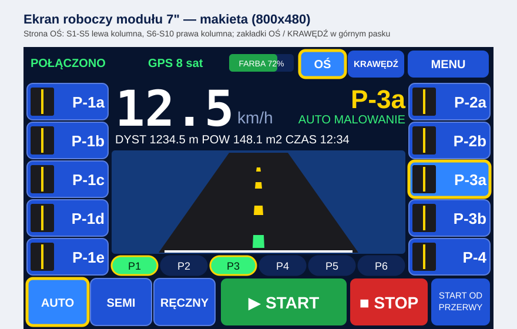
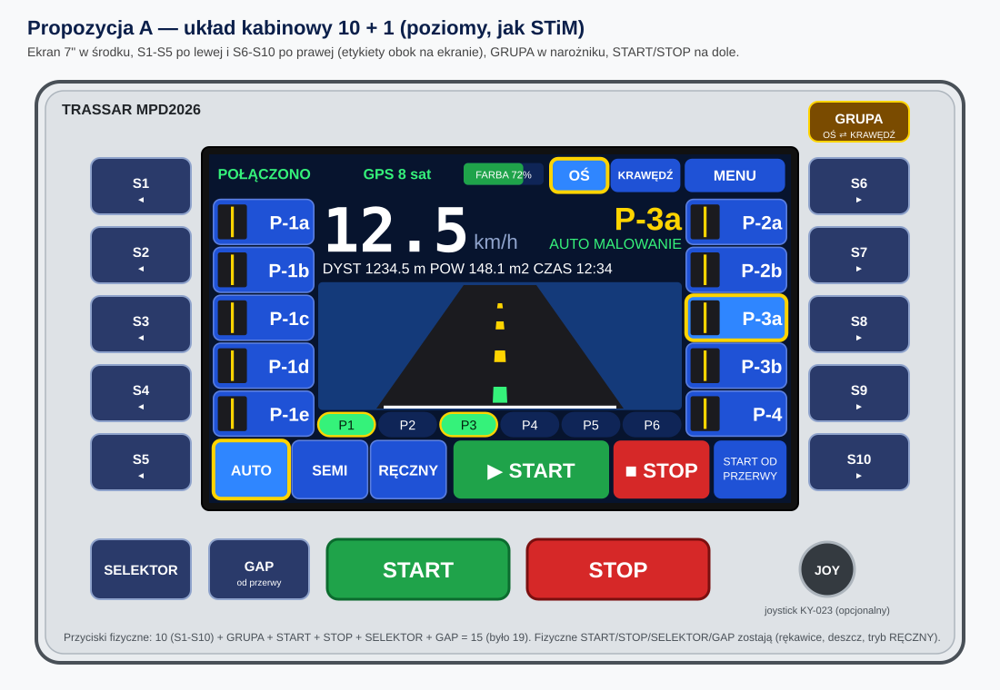
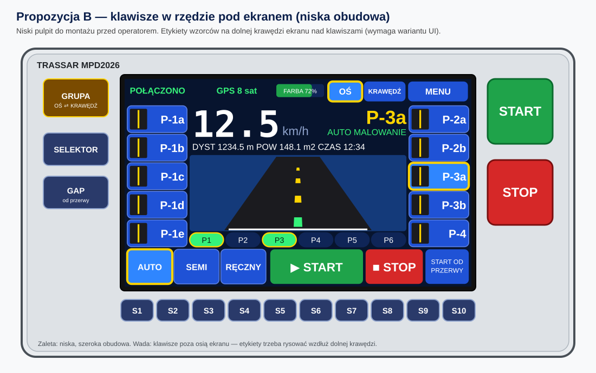
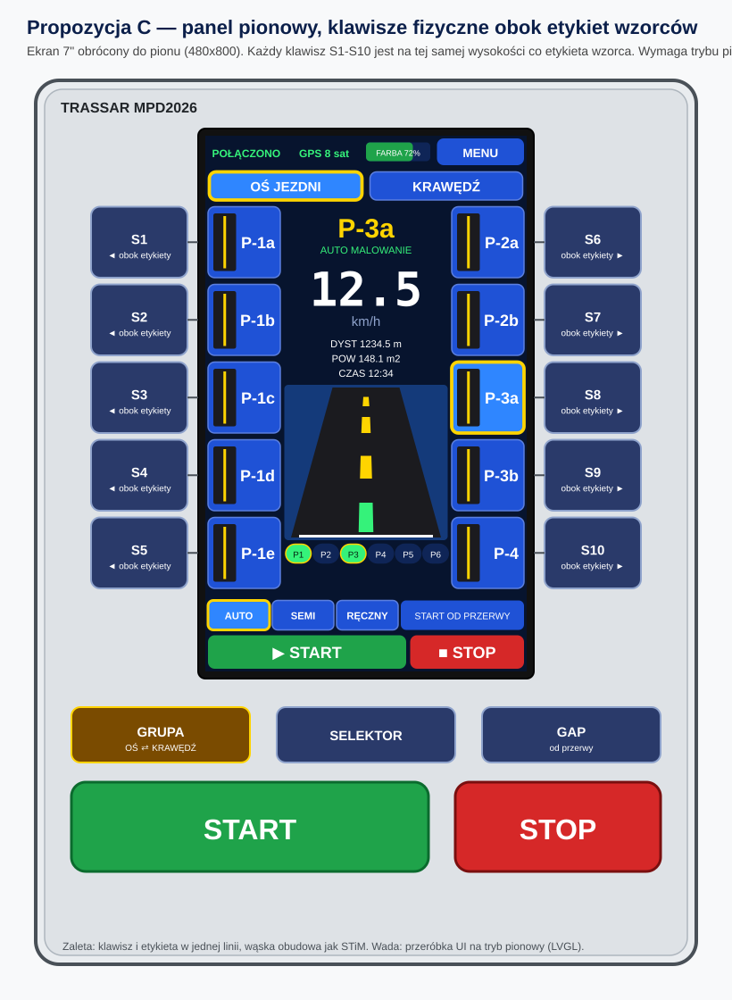
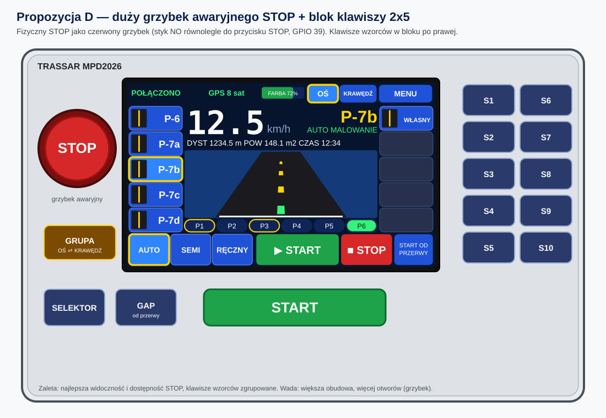

# Wizualizacje kontrolera — propozycje graficzne

Grafiki są w formacie SVG (skalowalne, otwierają się w przeglądarce i VS Code) i generowane skryptem
[`schematy/generate_svgs.py`](schematy/generate_svgs.py). Wymiary są **orientacyjne** (do ustalenia przy projekcie obudowy).

Wszystkie propozycje mają tę samą elektronikę: 10 przycisków wzorców **S1–S10** + przycisk **GRUPA** (MCP23017,
[SCHEMAT_PODLACZEN.md](SCHEMAT_PODLACZEN.md) sekcja 4.3), fizyczne **START, STOP, SELEKTOR, GAP** oraz ekran dotykowy 7".
Etykiety wzorców widnieją na ekranie obok przycisków; wzorce są podzielone na **OŚ** (10) i **KRAWĘDŹ** (5 + własny).

## Ekran roboczy (moduł 7")

Makieta ekranu 800×480: prędkość 7-segmentowa, widok drogi, 10 wzorców w bocznych kolumnach, zakładki OŚ / KRAWĘDŹ.



## Propozycja A — układ kabinowy 10 + 1 (poziomy, jak STiM)



- Ekran w środku, **S1–S5 po lewej, S6–S10 po prawej**, etykiety na ekranie dokładnie obok klawiszy.
- GRUPA w narożniku, na dole SELEKTOR, GAP, duże START i STOP, opcjonalny joystick.
- Orientacyjnie ok. 340 × 215 mm.
- **Zalety:** identyczny z obecnym ekranem (zero zmian w oprogramowaniu), klawisze przy etykietach, znany operatorom STiM.
- **Wady:** szeroka obudowa.

## Propozycja B — klawisze w rzędzie pod ekranem (niska obudowa)



- Rząd 10 klawiszy S1–S10 pod ekranem; GRUPA, SELEKTOR, GAP po lewej, START i STOP po prawej.
- Orientacyjnie ok. 340 × 190 mm.
- **Zalety:** niski pulpit, wygodny do montażu przed operatorem.
- **Wady:** klawisze poza osią etykiet — potrzebny wariant UI z etykietami wzdłuż dolnej krawędzi ekranu (do wykonania w module 7").

## Propozycja C — panel pionowy, klawisze fizyczne obok etykiet wzorców



- Ekran 7" obrócony do pionu (480 × 800). Etykiety wzorców stoją w dwóch kolumnach **przy krawędziach ekranu**, a
  fizyczne klawisze **S1–S5 (lewa strona) i S6–S10 (prawa strona) są na tej samej wysokości co etykieta** — każdy
  klawisz leży dokładnie obok „swojego" wzorca.
- W górnej części ekranu zakładki **OŚ JEZDNI / KRAWĘDŹ** (dotyk; ta sama grupa co fizyczny przycisk GRUPA).
- W środku: kod wzorca, prędkość, liczniki, pionowy widok drogi i kapsuły pistoletów; na dole tryby, START OD PRZERWY,
  START i STOP na ekranie.
- Pod ekranem blok fizyczny: GRUPA, SELEKTOR, GAP oraz duże START i STOP.
- Orientacyjnie ok. 245 × 330 mm.
- **Zalety:** klawisz i etykieta w jednej linii (najmniejsze ryzyko pomyłki), wąska obudowa, kształt najbardziej
  zbliżony do zdjęcia referencyjnego STiM.
- **Oprogramowanie:** tryb pionowy jest **zaimplementowany** — środowisko `sunton7_portrait` w `display-module`
  (`pio run -e sunton7_portrait -t upload`), pełny interfejs 480 × 800 razem ze wszystkimi oknami menu. Elektronika i firmware
  sterownika bez zmian. Weryfikacja obrotu ekranu i dotyku wymaga sprawdzenia na sprzęcie (patrz `-DUI_ROTATION`).
- **Wady:** wąski środek (244 px) — mniejsze cyfry prędkości niż w układzie poziomym.

## Propozycja D — duży grzybek awaryjnego STOP + blok klawiszy 2 × 5



- Czerwony **grzybek STOP** po lewej, klawisze S1–S10 zgrupowane w bloku 2 × 5 po prawej.
- Orientacyjnie ok. 340 × 215 mm.
- **Zalety:** najlepsza widoczność i dostępność STOP, klawisze wzorców zgrupowane.
- **Wady:** większa obudowa; klawisze są dalej od etykiet na ekranie (ekran można przesunąć w stronę bloku klawiszy).
- **Uwaga elektryczna:** firmware traktuje zwarcie GPIO 39 do GND jako naciśnięcie STOP (zbocze opadające). Grzybek
  podłączaj **stykiem NO równolegle do przycisku STOP** (jak pilot J4 i pedał J5). Grzybek zatrzaskowy pozostawałby
  w stanie „wciśnięty" — zachowanie przy trwale zwartym STOP (blokada START) wymaga sprawdzenia na sprzęcie, zanim
  zastosujesz zatrzask.

## Porównanie

| | A kabinowy | B pas pod ekranem | C pionowy | D grzybek + blok |
|---|-----------|--------------------|-----------|------------------|
| Przyciski fizyczne (S + GRUPA + START/STOP/SEL/GAP) | 15 | 15 | 15 | 15 (STOP jako grzybek) |
| Zmiany w oprogramowaniu | brak | wariant UI (etykiety u dołu) | **gotowe** (`sunton7_portrait`) | brak |
| Szerokość / wysokość (orient.) | 340 × 215 mm | 340 × 190 mm | 245 × 330 mm | 340 × 215 mm |
| Czytelność etykiet obok klawiszy | najlepsza | średnia | najlepsza (ta sama wysokość) | dobra |
| Dostępność STOP | dobra | dobra | dobra | najlepsza |
| Ryzyko | niskie | średnie | wysokie (UI) | niskie |

**Rekomendacja:** zacząć od **A** (nie wymaga żadnych zmian w oprogramowaniu) i rozważyć **grzybek STOP z D** jako
element bezpieczeństwa niezależnie od wybranego układu. Wariant **C** (pionowy, klawisze obok etykiet) jest
najbliższy zdjęciu referencyjnemu, a jego interfejs jest już gotowy w oprogramowaniu (`sunton7_portrait`).

## Regeneracja grafik

```bash
python docs/schematy/generate_svgs.py
```

Skrypt tworzy w katalogu `docs/schematy/`: `schemat_polaczen.svg` (schemat elektryczny), `ekran_roboczy.svg`
i cztery propozycje `panel_*.svg`. Piny w schemacie odpowiadają `src/config.h`.
