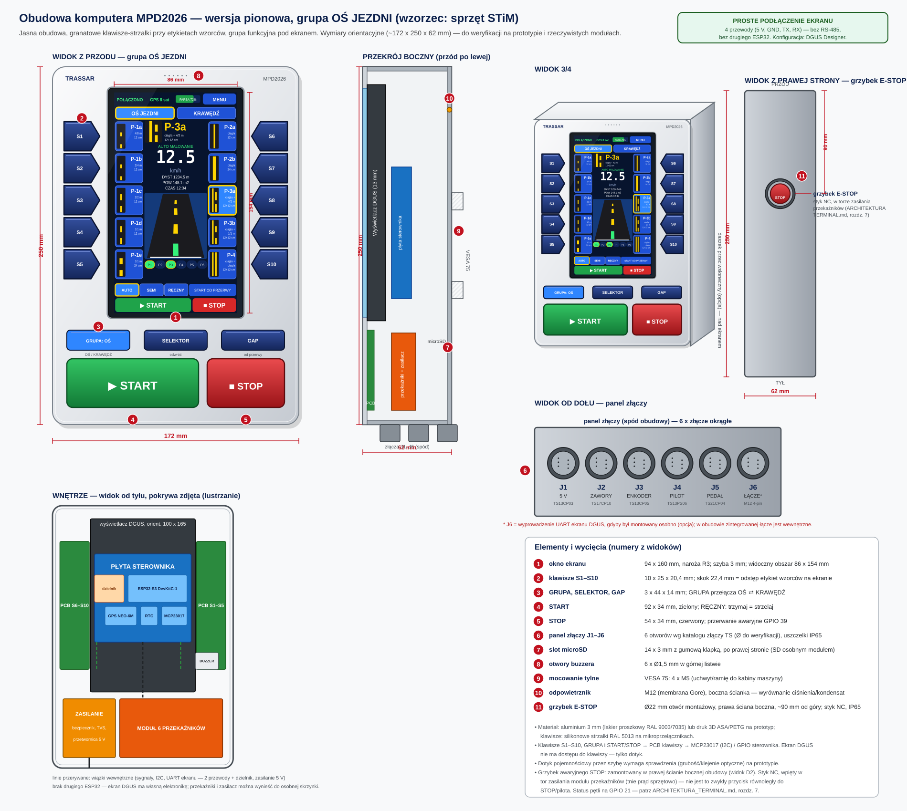
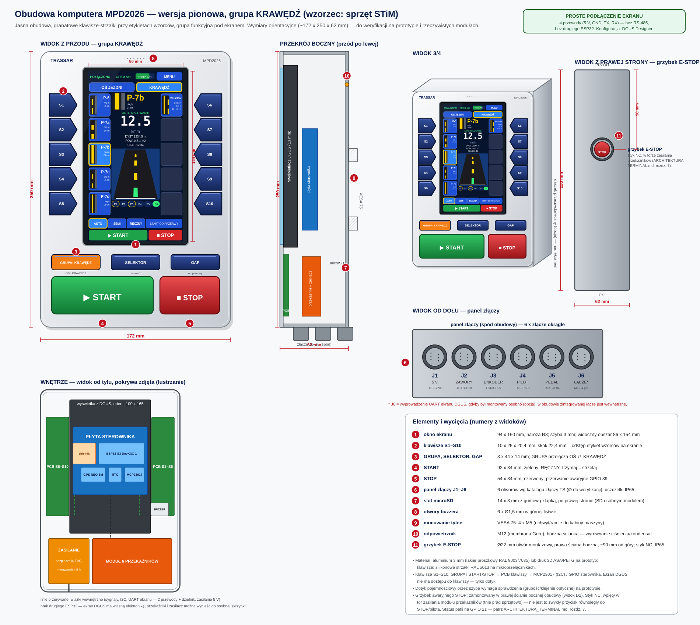
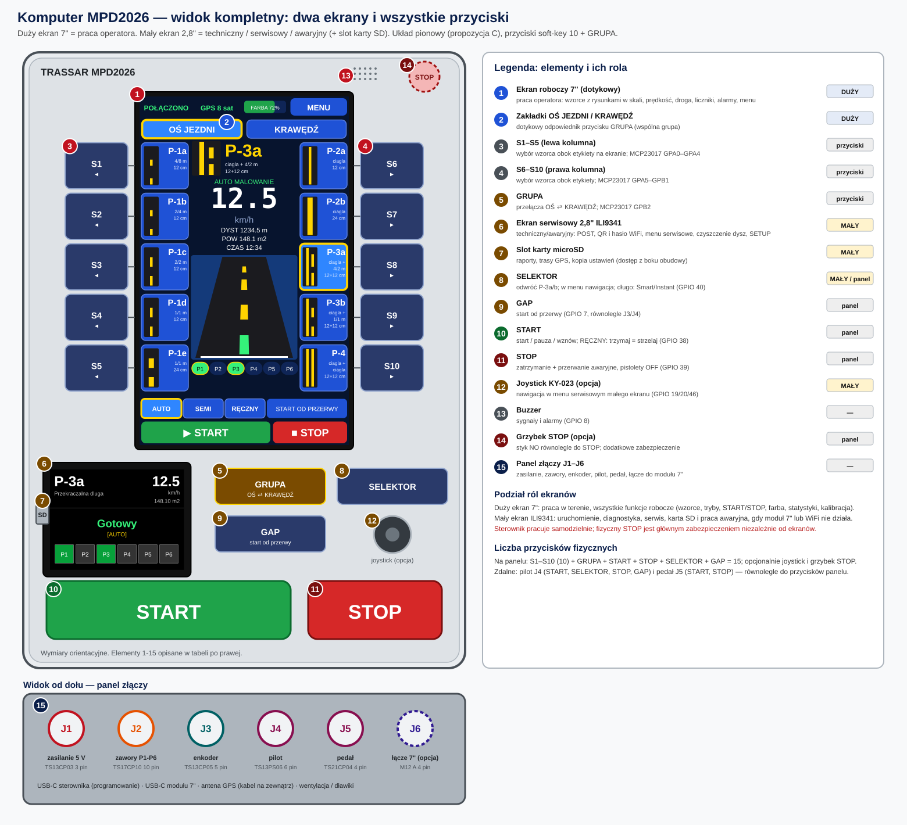
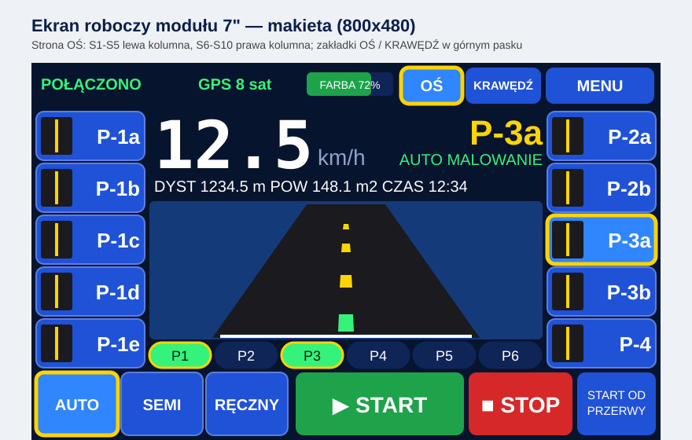
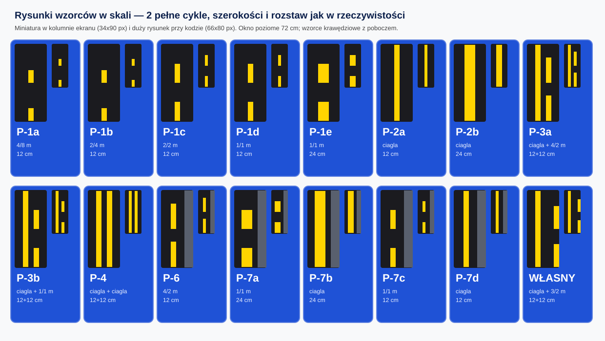
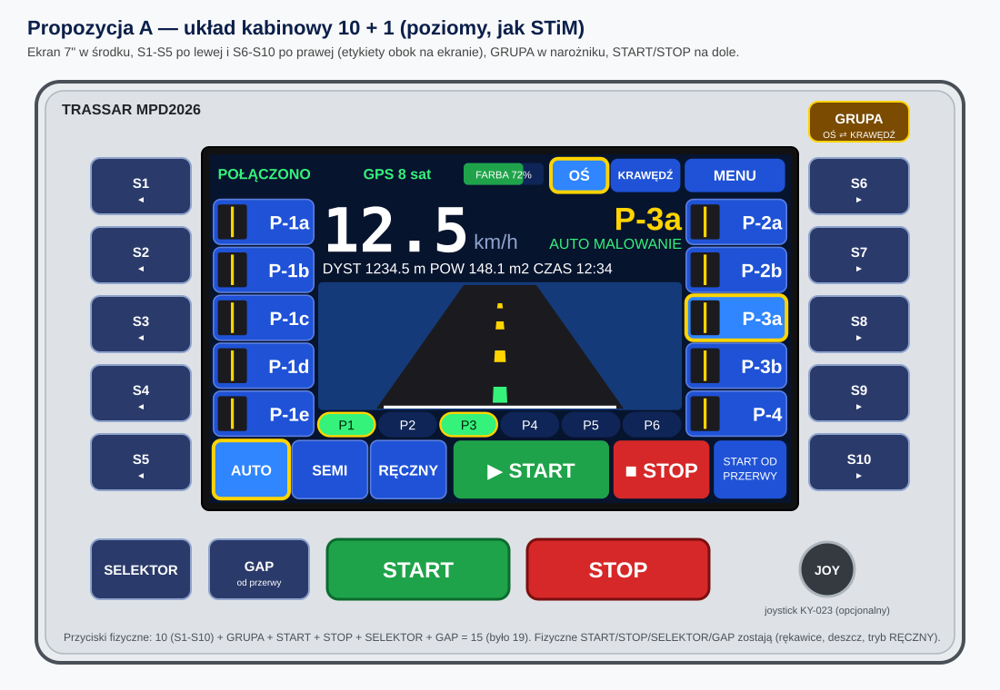
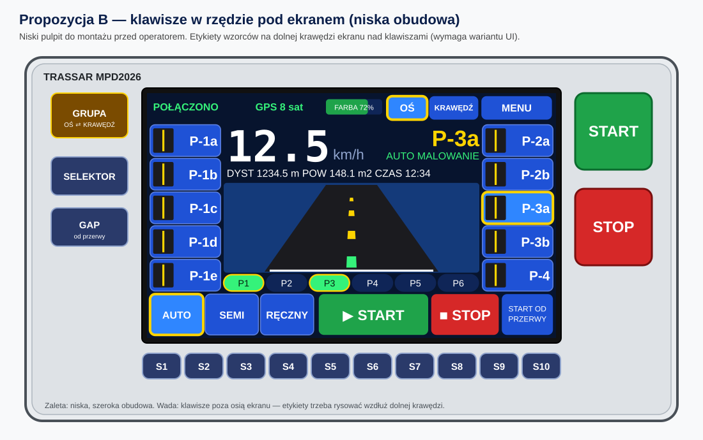
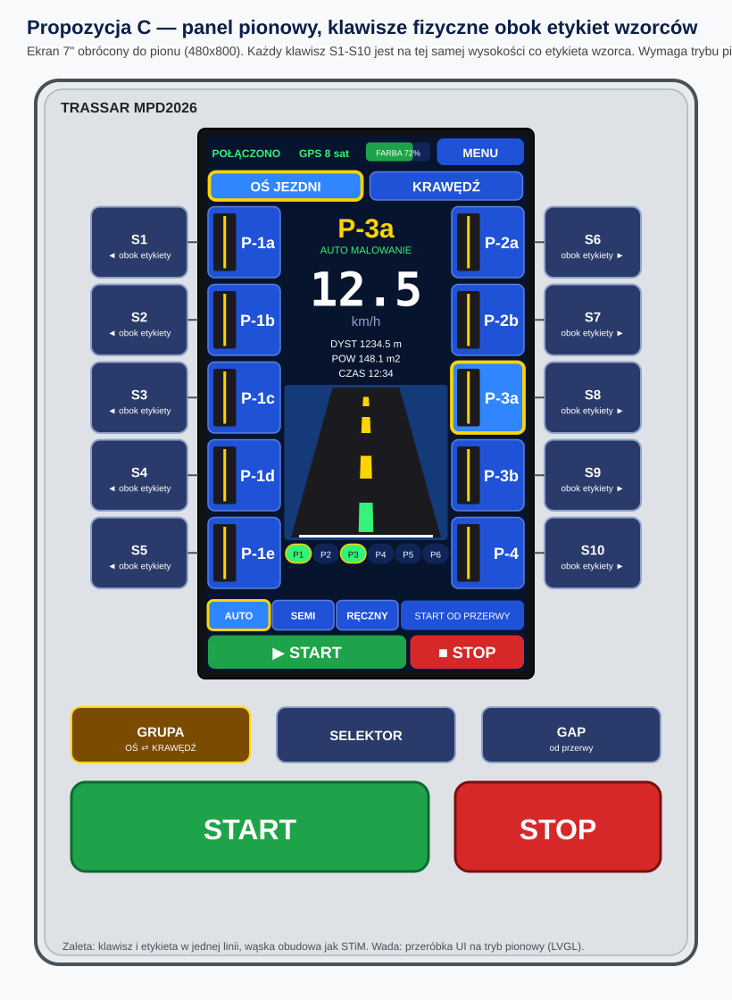
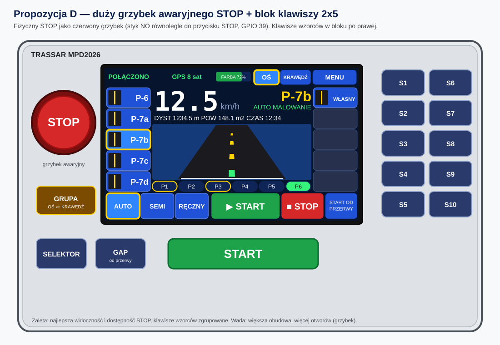

# Wizualizacje kontrolera — propozycje graficzne

Grafiki są w formacie SVG (skalowalne, otwierają się w przeglądarce i VS Code) i generowane skryptem
[`schematy/generate_svgs.py`](schematy/generate_svgs.py). Wymiary są **orientacyjne** (do ustalenia przy projekcie obudowy).

Wszystkie propozycje mają tę samą elektronikę: 10 przycisków wzorców **S1–S10** + przycisk **GRUPA** (MCP23017,
[SCHEMAT_PODLACZEN.md](SCHEMAT_PODLACZEN.md) sekcja 4.3), fizyczne **START, STOP, SELEKTOR, GAP** oraz ekran dotykowy 7".
Etykiety wzorców widnieją na ekranie obok przycisków; wzorce są podzielone na **OŚ** (10) i **KRAWĘDŹ** (5 + własny).

## Obudowa docelowa — pionowy ekran, wzorzec STiM (jeden duży ekran)

Wizualizacja obudowy komputera w architekturze docelowej ([ARCHITEKTURA_TERMINAL.md](ARCHITEKTURA_TERMINAL.md)): jeden ekran 7" w pionie
(wyświetlacz inteligentny DWIN DGUS, podłączony bezpośrednio 4 przewodami — bez RS-485, bez drugiego ESP32), jasna obudowa, **granatowe
klawisze w kształcie strzałek** przy etykietach wzorców (S1–S5 z lewej, S6–S10 z prawej, każdy na wysokości „swojego" wzorca), pod ekranem
GRUPA / SELEKTOR / GAP oraz duże START i STOP. Każdy rysunek zawiera widok z przodu, przekrój boczny, widok 3/4, panel złączy J1–J6 od
dołu, rozmieszczenie wnętrza oraz tabelę wycięć — kompletny zestaw wszystkich podzespołów.

Dostępne są **dwie wersje**, różniące się tylko tym, co w danej chwili pokazuje ekran i przycisk GRUPA (klawisze S1–S10 fizycznie się nie
zmieniają — to ten sam sprzęt, zmienia się tylko aktywna strona wzorców):

**Wersja OŚ JEZDNI** (S1–S5 = P-1a…P-1e, S6–S10 = P-2a, P-2b, P-3a, P-3b, P-4):



**Wersja KRAWĘDŹ** (S1–S5 = P-6, P-7a…P-7d, S6 = WŁASNY, S7–S10 nieużywane w tej grupie):



| Parametr | Wartość (orientacyjnie) |
|----------|--------------------------|
| Wymiary korpusu | ok. **172 × 250 × 62 mm** (szer. × wys. × głęb.) |
| Ekran | 7" pionowo: okno 94 × 160 mm, obszar aktywny 86 × 154 mm; wyświetlacz DGUS (np. `DMG10600T070_09WTC`) ok. 100 × 165 mm |
| Klawisze S1–S10 | 10 × 25 × 20,4 mm, skok 22,4 mm = odstęp etykiet wzorców na ekranie |
| Dolna grupa | GRUPA, SELEKTOR, GAP 44 × 14 mm; START 92 × 34 mm; STOP 54 × 34 mm |
| Złącza (spód) | J1 5 V, J2 zawory, J3 enkoder, J4 pilot, J5 pedał, J6 wyprowadzenie UART ekranu (opcja, gdy ekran montowany osobno) |
| Mocowanie | VESA 75 (4 × M5) z tyłu; slot microSD z boku; odpowietrznik M12 |

W tej wizualizacji z panelu zniknął mały ekran ILI9341 (joystick **zostaje** — nawiguje po menu równolegle z dotykiem,
patrz [ARCHITEKTURA_TERMINAL.md](ARCHITEKTURA_TERMINAL.md) rozdz. 6 — rysunek panelu go nie pokazuje, bo montowany jest
wewnątrz obudowy, nie na płycie czołowej). **SELEKTOR** (GPIO 40) jest narysowany jako **opcjonalny** przycisk
odwracania P-3a/b — firmware nadal go obsługuje, a odwracanie jest też dostępne dotykiem na ekranie, więc można go pominąć (wtedy GPIO 40 jest wolny;
patrz mapa pinów w [ARCHITEKTURA_TERMINAL.md](ARCHITEKTURA_TERMINAL.md), rozdz. 3).
Wymiary i rozmieszczenie wnętrza są **orientacyjne** — do weryfikacji na prototypie i rzeczywistych modułach (m.in. dotyk przez szybę).

Grzybek **STOP awaryjnego (E-STOP)** jest zamontowany w **prawej ścianie bocznej** obudowy (widok „WIDOK Z PRAWEJ
STRONY", pozycja 11 w tabeli wycięć) — styk NC, wpięty w tor zasilania modułu przekaźników (tnie prąd sprzętowo,
niezależnie od firmware); status pętli trafia na GPIO 21 (patrz [ARCHITEKTURA_TERMINAL.md](ARCHITEKTURA_TERMINAL.md)
rozdz. 7). Umiejscowienie z boku (nie na płycie czołowej) zostawia okno ekranu i pas klawiszy nienaruszone.

## Komputer kompletny — dwa ekrany i wszystkie przyciski

> **Wariant przejściowy.** Docelowo (patrz [ARCHITEKTURA_TERMINAL.md](ARCHITEKTURA_TERMINAL.md)) zostaje **jeden duży ekran**, bez małego ILI9341
> i bez joysticka/SELEKTORA (14 przycisków na panelu). Poniższy widok obowiązuje do czasu przeniesienia funkcji serwisowych na duży ekran.

Widok rekomendowanego układu (panel pionowy, propozycja C) z **dwoma ekranami** o różnych rolach, wszystkimi przyciskami
fizycznymi oraz panelem złączy od dołu. Numery elementów odpowiadają legendzie na rysunku.



| Element | Rola |
|---------|------|
| **Duży ekran 7" (dotykowy)** | ekran **roboczy**: wzorce z rysunkami w skali, prędkość, droga, liczniki, alarmy, farba, statystyki, menu |
| **Mały ekran 2,8" ILI9341** | ekran **techniczny / serwisowy / awaryjny**: POST, QR i hasło WiFi, menu serwisowe, czyszczenie dysz, SETUP; **slot karty microSD** (dostęp z boku) |
| **S1–S10** (kolumny przy dużym ekranie) | wybór wzorca; każdy klawisz obok etykiety na tej samej wysokości (MCP23017) |
| **GRUPA** | przełącza OŚ ⇄ KRAWĘDŹ |
| **START / STOP** | start-pauza-wznów (RĘCZNY: trzymaj = strzelaj); STOP z przerwaniem awaryjnym (GPIO 38 / 39) |
| **SELEKTOR, GAP** | odwrócenie P-3a/b i nawigacja w menu / Smart-Instant; start od przerwy (GPIO 40 / 7) |
| **Joystick KY-023** (opcja) | nawigacja w menu serwisowym małego ekranu |
| **Grzybek STOP** (opcja) | styk NO równolegle do STOP — dodatkowe zabezpieczenie |
| **Buzzer** | sygnały i alarmy (GPIO 8) |
| **Panel złączy J1–J6** | zasilanie, zawory, enkoder, pilot (4 przyciski), pedał (2 pedały), łącze do modułu 7" (opcja) |

Na panelu jest **15 przycisków fizycznych** (10 + GRUPA + START + STOP + SELEKTOR + GAP); pilot J4 i pedał J5 działają równolegle.
Mały ekran można zamontować z boku lub wewnątrz obudowy, o ile slot karty SD pozostaje dostępny.

## Ekran roboczy (moduł 7")

Makieta ekranu 800×480: prędkość 7-segmentowa, widok drogi, 10 wzorców w bocznych kolumnach, zakładki OŚ / KRAWĘDŹ.



## Rysunki wzorców w skali

Obok kodu każdego wzorca ekran pokazuje jego **dokładny rysunek w skali**: szerokości linii (12 i 24 cm), rozstaw linii
podwójnych, proporcje kresek i przerw (dwa pełne cykle), a dla wzorców krawędziowych — pobocze. Pod rysunkiem jest zapis
liczbowy (np. `ciagla + 4/2 m`, `12+12 cm`). Arkusz wszystkich wzorców:



## Propozycja A — układ kabinowy 10 + 1 (poziomy, jak STiM)



- Ekran w środku, **S1–S5 po lewej, S6–S10 po prawej**, etykiety na ekranie dokładnie obok klawiszy.
- GRUPA w narożniku, na dole SELEKTOR, GAP, duże START i STOP, opcjonalny joystick.
- Orientacyjnie ok. 340 × 215 mm.
- **Zalety:** identyczny z obecnym ekranem (zero zmian w oprogramowaniu), klawisze przy etykietach, znany operatorom STiM.
- **Wady:** szeroka obudowa.

## Propozycja B — klawisze w rzędzie pod ekranem (niska obudowa)



- Rząd 10 klawiszy S1–S10 pod ekranem; GRUPA, SELEKTOR, GAP po lewej, START i STOP po prawej.
- Orientacyjnie ok. 340 × 190 mm.
- **Zalety:** niski pulpit, wygodny do montażu przed operatorem.
- **Wady:** klawisze poza osią etykiet — potrzebny wariant UI z etykietami wzdłuż dolnej krawędzi ekranu (do wykonania w module 7").

## Propozycja C — panel pionowy, klawisze fizyczne obok etykiet wzorców



- Ekran 7" obrócony do pionu (480 × 800). Etykiety wzorców stoją w dwóch kolumnach **przy krawędziach ekranu**, a
  fizyczne klawisze **S1–S5 (lewa strona) i S6–S10 (prawa strona) są na tej samej wysokości co etykieta** — każdy
  klawisz leży dokładnie obok „swojego" wzorca.
- W górnej części ekranu zakładki **OŚ JEZDNI / KRAWĘDŹ** (dotyk; ta sama grupa co fizyczny przycisk GRUPA).
- W środku: kod wzorca, prędkość, liczniki, pionowy widok drogi i kapsuły pistoletów; na dole tryby, START OD PRZERWY,
  START i STOP na ekranie.
- Pod ekranem blok fizyczny: GRUPA, SELEKTOR, GAP oraz duże START i STOP.
- Orientacyjnie ok. 245 × 330 mm.
- **Zalety:** klawisz i etykieta w jednej linii (najmniejsze ryzyko pomyłki), wąska obudowa, kształt najbardziej
  zbliżony do zdjęcia referencyjnego STiM.
- **Oprogramowanie:** tryb pionowy jest **zaimplementowany** — środowisko `sunton7_portrait` w `display-module`
  (`pio run -e sunton7_portrait -t upload`), pełny interfejs 480 × 800 razem ze wszystkimi oknami menu. Elektronika i firmware
  sterownika bez zmian. Weryfikacja obrotu ekranu i dotyku wymaga sprawdzenia na sprzęcie (patrz `-DUI_ROTATION`).
- **Wady:** wąski środek (244 px) — mniejsze cyfry prędkości niż w układzie poziomym.

## Propozycja D — duży grzybek awaryjnego STOP + blok klawiszy 2 × 5



- Czerwony **grzybek STOP** po lewej, klawisze S1–S10 zgrupowane w bloku 2 × 5 po prawej.
- Orientacyjnie ok. 340 × 215 mm.
- **Zalety:** najlepsza widoczność i dostępność STOP, klawisze wzorców zgrupowane.
- **Wady:** większa obudowa; klawisze są dalej od etykiet na ekranie (ekran można przesunąć w stronę bloku klawiszy).
- **Uwaga elektryczna (zaktualizowane):** ten rysunek powstał, zanim STOP awaryjny miał docelowy projekt — opisywał
  grzybek jako zwykły styk NO równolegle do GPIO 39 (jak pilot J4/pedał J5). **Docelowe rozwiązanie jest inne i
  bezpieczniejsze:** grzybek (styk NC, zatrzaskowy) tnie zasilanie pistoletów/pomp **sprzętowo**, w torze zasilania
  modułu przekaźników — nie przez GPIO 39 — a osobna pętla statusu idzie na GPIO 21 (patrz
  [ARCHITEKTURA_TERMINAL.md](ARCHITEKTURA_TERMINAL.md) rozdz. 7 i [schemat_polaczen_docelowy.svg](schematy/schemat_polaczen_docelowy.svg)).
  Zatrzask grzybka jest tu zaletą, nie problemem: firmware wymaga jawnego potwierdzenia operatora (`ack_estop`)
  zanim pozwoli wznowić malowanie, więc trwałe zwarcie pętli nie blokuje niczego poza samym wznowieniem.

## Porównanie

| | A kabinowy | B pas pod ekranem | C pionowy | D grzybek + blok |
|---|-----------|--------------------|-----------|------------------|
| Przyciski fizyczne (S + GRUPA + START/STOP/SEL/GAP) | 15 | 15 | 15 | 15 (STOP jako grzybek) |
| Zmiany w oprogramowaniu | brak | wariant UI (etykiety u dołu) | **gotowe** (`sunton7_portrait`) | brak |
| Szerokość / wysokość (orient.) | 340 × 215 mm | 340 × 190 mm | 245 × 330 mm | 340 × 215 mm |
| Czytelność etykiet obok klawiszy | najlepsza | średnia | najlepsza (ta sama wysokość) | dobra |
| Dostępność STOP | dobra | dobra | dobra | najlepsza |
| Ryzyko | niskie | średnie | wysokie (UI) | niskie |

**Rekomendacja:** zacząć od **A** (nie wymaga żadnych zmian w oprogramowaniu) i rozważyć **grzybek STOP z D** jako
element bezpieczeństwa niezależnie od wybranego układu. Wariant **C** (pionowy, klawisze obok etykiet) jest
najbliższy zdjęciu referencyjnemu, a jego interfejs jest już gotowy w oprogramowaniu (`sunton7_portrait`).

## Regeneracja grafik

```bash
python docs/schematy/generate_svgs.py
```

Skrypt tworzy w katalogu `docs/schematy/`: `schemat_polaczen.svg` (schemat elektryczny), `ekran_roboczy.svg`
i cztery propozycje `panel_*.svg`. Piny w schemacie odpowiadają `src/config.h`.
